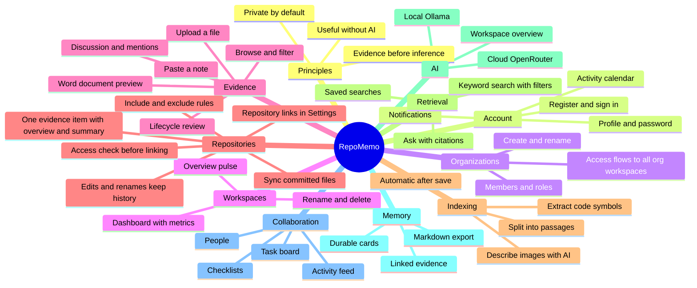

# RepoMemo: Functional Mindmap

> **Audience:** product owners, new teammates, and anyone who needs to know *what RepoMemo does* without reading code.
> **Companion:** [TECHNICAL_MINDMAP.md](TECHNICAL_MINDMAP.md) covers *how* it works, for engineers. [ROADMAP.md](ROADMAP.md) covers what has shipped and what comes next.
> **Scope:** reflects the code at `V0.1.32` (2026-09-29). The shared **web app + API** is the primary product surface. The local desktop app is described briefly in [§12](#12-local-desktop-mode).

---

## The product in one paragraph

RepoMemo is a **team memory workspace for technical knowledge**. A team stores its evidence (notes, code files, Markdown docs, Word documents, screenshots and diagrams) in a shared workspace. RepoMemo **indexes** that evidence so it can be **searched** by keyword, and can optionally **ask an AI** questions that are answered **only from the stored evidence, with citations**. Knowledge worth keeping is saved as **memory cards**. Around that core, the team can **review** evidence (lifecycle status), **discuss** it (comments with @mentions), and **track work** (a task board with checklists). The core stays useful without AI: storing, browsing, indexing and searching all work with no AI provider configured.

---

## Who it's for and what it stands for

### Users

RepoMemo serves **developers and technical teams working inside an active codebase**. They reach for it when they need to:

- investigate implementation details
- recall **why** a decision was made
- onboard onto an unfamiliar system
- recover reliable context from code, documents, runbooks, incidents and architecture records

**Success** means a user moves from an uncertain technical question to **trustworthy source context** quickly, understands **where the answer came from**, and **preserves** useful knowledge for later.

### Positioning

RepoMemo is **structured memory first and an AI interface second**. Its source of truth is durable storage plus explicit metadata: indexes, symbols, links and citations. It is **not** a chat transcript or an opaque embedding store. Cloud AI is optional and is always an explicit choice.

### Product principles

1. **Evidence before inference.** Show sources, paths, line ranges, status and provenance.
2. **Value without AI.** Browsing, indexing and retrieval stay useful with AI switched off.
3. **Dense but legible.** Optimize for technical scanning without turning the workspace into visual noise.
4. **State is obvious.** Storage, indexing progress, provider state and errors are visible and actionable.
5. **Preserve trust.** Never blur durable stored facts with generated interpretation.

### Constraints the product must respect

- AI providers are optional. Sending content to a cloud provider requires explicit configuration and acknowledgement.
- Answers and summaries must stay tied to inspectable evidence and citations.
- Product copy must never invent customers, testimonials, usage metrics, benchmarks, pricing, or capabilities that are not built. The repository contains no approved marketing claims.

### Voice

The voice is **calm, precise, technical, private by default, and evidence-oriented**. The product states system facts directly, avoids hype, and always distinguishes trustworthy stored facts from optional AI interpretation.

### Experience and accessibility

- The product is used as a **focused technical workbench**. It must support dense scanning, keyboard-friendly operation, long paths and identifiers, code-oriented content, large result sets, and both light and dark themes.
- It must be **fully usable by keyboard** with visible focus states, respect **reduced-motion** preferences, keep **readable contrast** in both themes, and accommodate long technical identifiers without hiding critical context.

> The visual system (colors, type, components) is defined separately in [DESIGN.md](../DESIGN.md).

---

## The mindmap



Each branch below maps to one section of this document. Deeper branch documents will live next to this file (see [Branch documents](#branch-documents-planned)).

---

## 1. Who uses it: roles and permissions

RepoMemo has two levels of membership.

**Organization**: the team or company boundary. Roles: `owner`, `admin`, `member`.
**Workspace**: one body of knowledge inside an organization, such as a project or service. Roles: `owner`, `admin`, `member`, `viewer`.

Joining an organization **automatically grants access to every workspace in it**: an org owner becomes a workspace owner, an org admin becomes an admin, and an org member becomes a member. A workspace can also add a registered user directly. That user then joins the organization as a `member`.

### What each workspace role can do

| Capability | Owner | Admin | Member | Viewer |
|---|:-:|:-:|:-:|:-:|
| Read evidence, search, memory, tasks | ✅ | ✅ | ✅ | ✅ |
| Ask AI / generate AI overview¹ | ✅ | ✅ | ✅ | ✅ |
| Add, rename, delete evidence (indexing is automatic) | ✅ | ✅ | ✅ | — |
| Inspect stored index chunks and re-index one artifact | ✅ | ✅ | — | — |
| Create and edit memory cards | ✅ | ✅ | ✅ | — |
| Create and edit tasks, comment, change lifecycle | ✅ | ✅ | ✅ | — |
| Edit or delete *other people's* comments and tasks | ✅ | ✅ | — | — |
| Open People / Activity / Settings sections | ✅ | ✅ | — | — |
| Add or remove members | ✅ | ✅² | — | — |
| Configure the AI provider | ✅ | ✅ | — | — |
| Choose who may use AI in the workspace | ✅ | ✅ | — | — |
| Add, check, edit or remove repository links (Settings) | ✅ | ✅ | — | — |
| Sync a connected repository | ✅ | ✅ | ✅ | — |
| Rename or delete the workspace | ✅ | — | — | — |

¹ The AI features need an enabled provider. By default everyone in the workspace can use them, viewers included; owners and admins can keep them to members and above, or to admins and owners (**Settings › Who can use AI**). Each person can also make a limited number of AI requests per hour (120 by default, set by the server operator), so nobody can run up a cloud bill by accident.
² Admins can grant only `member` or `viewer`, and cannot change or remove other admins or the owner. Nobody can assign `owner` through the UI.

### Organization permissions

| Action | Org owner | Org admin | Org member |
|---|:-:|:-:|:-:|
| Create a workspace in the org | ✅ | ✅ | — |
| Add members / change roles | ✅ | ✅ (not admins) | — |
| Rename the organization | ✅ | — | — |

Any signed-in user can create a new organization and becomes its owner.

---

## 2. Account and session

| Feature | What the user experiences |
|---|---|
| **Register** (`/register`) | Email, display name (1–120 characters), password (12+ characters). The user is signed in immediately. The server operator can close registration; the first account can always be created. |
| **Sign in** (`/login`) | Email and password. A wrong email and a wrong password produce the same message. After 10 failed attempts in a row the account is locked for 15 minutes from that address (both configurable), and too many attempts from one address are slowed down. |
| **Session** | Renewed silently in the background for up to 30 days of inactivity, so nobody is signed out mid-work. |
| **Profile** (`/profile`) | Rename yourself, change your password (the current password is required; **every other device is signed out**, this one stays signed in), **sign out everywhere** (every device, this one included), see last connection time, workspace count, a **365-day contribution calendar**, and **tasks assigned to you**. |
| **Notifications** (`/notifications`) | "Task assigned to you" and "You were mentioned in evidence discussion". Mark one or all as read. Clicking a notification opens the related page. |
| **Theme** | Light and dark toggle, remembered per browser. |
| **Sign out** | Always visible in the header. |

**Not available yet:** password reset, email invitations for people without an account, SSO.

---

## 3. Organizations and the dashboard

- **Dashboard** (`/dashboard`): every organization you belong to, its workspaces, and aggregate totals (artifacts, active tasks, memory cards).
- **Workspace directory** (`/workspaces`): pick an organization, create workspaces (owner or admin), and create a new organization.
- **Organization administration**: list members, add a registered user by email with a role, and remove members, subject to the rules in §1.

---

## 4. Workspaces

A workspace is opened at `/workspaces/:id/<section>` and has **nine sections**:

| Section | Purpose | Who sees it |
|---|---|---|
| **Overview** | "Workspace pulse" metrics and the AI overview | Everyone |
| **Evidence** | The evidence ledger: browse, add notes, upload files. New evidence is indexed automatically | Everyone (only writers can add) |
| **Documents** | The same ledger filtered to Word files, with an inline text preview | Everyone |
| **Retrieval** | Keyword search, saved searches, "Ask your evidence" | Everyone |
| **Memory** | Team memory cards: search and create | Everyone |
| **Tasks** | Team action board | Everyone |
| **People** | Member list and a summary of *your* capabilities | Owner and admin |
| **Activity** | Recent activity feed and a 365-day calendar | Owner and admin |
| **Settings** | Members, AI provider, rename or delete | Owner and admin (rename and delete are owner only) |

### Workspace pulse (Overview)

This is a live snapshot computed on each visit:

- **Index coverage**: the percentage of artifacts that are indexed. Pending artifacts are counted and their size is shown.
- **Fresh evidence**: artifacts added or updated in the last 7 days.
- **Knowledge density**: searchable passages per indexed file.
- **Code symbols**: functions and classes extracted from code.
- **Team**: member count, active tasks, blocked and overdue tasks ("at risk"), comment count.
- **Charts**: evidence by type, storage by type, languages, 14-day activity, activity by action, and members by role.

Deleting a workspace **permanently removes** all of its evidence, memory, tasks and memberships.

---

## 5. Evidence (artifacts)

Evidence is anything the team stores. Each item is called an **artifact**.

### Adding evidence

| Method | Details |
|---|---|
| **Paste a shared note** | A title and some text. You can pick a language: Markdown, Text, or a code language. Pasted notes are grouped under the source "Pasted notes". |
| **Upload a file** | Up to **10 MiB**. Uploads are grouped under the source "Shared uploads". |

**Supported file types:** Markdown (`md`, `mdx`), text (`txt`), Word (`doc`, `docx`), code and config (`rs`, `ts`, `tsx`, `js`, `jsx`, `py`, `json`, `toml`, `yaml`, `yml`, `sql`, `html`, `css`, `sh`, `ps1`), and images (`png`, `jpg`, `jpeg`, `gif`, `webp`, `svg`, `bmp`).

If the same file with the same content is uploaded twice, it is stored only once.

### Working with evidence

- **Browse**: filter by name or path and by type, and switch between grid and list views.
- **Artifact page** (`/workspaces/:id/artifacts/:artifactId`) shows:
  - metadata: type, language, and whether it is indexed
  - **stored content** as a text preview; Word files are converted to text
  - **indexing status**: *Indexing…* right after saving, then *Indexed*
  - for owners and admins only, an **Indexed chunks** button that opens a dialog with the stored passages, their line ranges, and a **Re-index** action
  - **rename** and **delete**, for writers
- **Lifecycle review**: every artifact has a status:
  `active` → `needs_review` → `verified` / `outdated` / `superseded`
  Each artifact can also have an **owner** (a workspace member) and a **review note**. `superseded` requires choosing the replacement artifact. Every change is kept in a **lifecycle history**.
- **Discussion**: threaded comments of up to 5,000 characters. Typing `@someone@example.com` **notifies that workspace member**. Authors edit or delete their own comments, and admins and owners can moderate any comment.

---

## 5b. Repositories

A team's code usually already lives in a git repository, with many files and a history. Uploading it file by file would be slow and would go stale at the next commit. The **Repositories** section connects a repository instead and keeps the workspace in step with it.

| What you do | What happens |
|---|---|
| **Add a repository link** (owners and admins, in **Settings › Repositories**) | Enter the folder of a git checkout on the server and press **Check access**. RepoMemo tells you whether the server can read it, which branch and commit it would read, and about how many files it would index. **Link and sync** stores the link and starts the first sync. RepoMemo reads what the branch has **committed**: never uncommitted edits, ignored files or build output. |
| **Sync now** (writers) | RepoMemo compares the branch's latest commit with what it stored. Only new and changed files are read and indexed; unchanged files cost nothing. |
| **Automatic sync** | Every few minutes the server checks whether each linked branch has new commits and syncs the ones that moved, so nobody has to press Sync now. A sync that fails is not retried for the same commit for an hour. |
| **Edit a link** (owners and admins, in Settings) | Choose a branch (default: whatever is checked out), and **include** or **exclude** paths with patterns such as `docs/**`, `src/`, `**/*.test.ts`. Applies from the next sync. |
| **Browse files** | The repository's files, filterable by path. Each opens like any evidence: preview, lifecycle, comments. |
| **Remove a link** (owners and admins, in Settings) | Removes the repository's files, their index and memory links from the workspace. The repository on disk is untouched. |

**How files follow the repository:**

- An **edited** file is updated in place and re-indexed. Its comments, memory links and tasks stay attached. If it was *verified*, it goes back to *needs review*.
- A **renamed** file (same content) keeps its identity under the new path.
- A **deleted** file stays readable for the memory cards and comments that cite it, but it leaves search and Ask, and is marked *outdated* with the commit that removed it.

**Skipped automatically:** dependency and build folders (`node_modules/`, `vendor/`, `dist/`, `build/`, `target/`…), lock files, minified files, images, files over 1 MB and binary files. Each sync reports how many files were skipped and why.

**The repository as one evidence item.** Each linked repository appears in the **Evidence ledger as a single item**, next to notes and uploads, and can be reviewed, discussed, cited by memory cards and moved into a folder like any evidence. Opening it shows the **repository page**:

- **Sync state**: location, branch, commit, files, with *Sync now* and a file browser.
- **Summary**: what the repository is, its main parts, technologies, how to build or run it and where to start reading, written by the workspace's AI provider **only when someone asks**, with links to the files it is based on. The page says when the repository has changed since the summary was written.
- **Content overview**, with no AI: languages, folders, key files (README, manifests, entry points, docs), the opening of the README, and recent commits.

The **knowledge map** draws each repository as one ringed dot, sized by all of its files and linked to similar evidence and to memory cards that cite any of its files, and the **health checks** compare the repository as a whole rather than file by file.

The repository's individual files are searchable and citable like any evidence, but they are listed in the Repositories section (and from the repository page) rather than the Evidence ledger, and they cannot be renamed or deleted one by one: change them in the repository, or exclude their path.

**Availability:** repository links are a setting of each workspace; nothing has to be configured on the server. A link must point at a folder the server can read, so for now only repositories on the server's own disk can be linked; remote repositories (by URL) are planned. See the [technical design](technical/repository-sources.md).

---

## 6. Indexing: making evidence searchable

Evidence must be **indexed** before search, Ask, or the AI overview can use it. Indexing is **automatic**: as soon as a note is pasted or a file is uploaded, the server queues it and indexes it in the background. Nobody presses an index button, and the ledger shows *Indexing…* until the artifact is ready. Artifacts that were stored but never indexed (for example when the server restarted mid-queue) are picked up again at startup.

The stored passages are an administrative detail. Regular members see search results, snippets and citations, but not the raw chunk list. Owners and admins can open it from the artifact page, and can re-index a single artifact from there (useful after an AI provider is configured for images).

In plain terms, indexing does the following:

1. **Reads the text.** Word documents are converted locally.
2. **Splits it into passages.** Markdown is split by heading. TypeScript, JavaScript, Python and Rust are split along their structure, so a function, class or impl block is not cut in half: small neighbours are grouped, and large classes are split by method. Each passage records its scope (for example `impl Store > save`), which is also searchable. Other text and code files are split into windows of about 100 lines. Every passage keeps its line range so citations point to exact lines.
3. **Extracts code symbols** from TypeScript, JavaScript, Python and Rust: functions, classes, methods, interfaces and enums.
4. **Handles images differently.** If the workspace has an AI provider enabled, the image is sent to it and a **text description** is stored and made searchable, including any text visible in the image. Without a provider, images stay stored but cannot be searched.

Re-indexing keeps every passage whose text did not change, so memory cards and any stored embeddings that point at it stay valid. Only passages that actually changed are replaced. When RepoMemo improves how it splits content, existing evidence is refreshed automatically in the background the next time the server starts, and images are never re-analysed by that refresh.

**Current behavior to be aware of:** the background queue processes up to two artifacts at a time, and the ledger polls for status rather than receiving live events. If an artifact fails to index it stays *Not indexed* and is retried at the next server start. Images stored before an AI provider was configured are indexed with no description and need a manual re-index by an admin.

---

## 7. Retrieval: finding evidence

### Keyword search

- Searches the **indexed passages** of the workspace.
- Every word must match, and words match as prefixes: `auth tok` finds "authentication token".
- Filters: **file type**, **language**, **source**, and **10 / 20 / 50 results**. Filter options are built from what has actually been indexed.
- Each result shows the title, type, language, source, a snippet, the path, and the line range. Clicking a result opens the artifact.
- Search does **not** use AI and works offline.

### Saved searches

Writers can save a named search that includes its filters. Anyone can re-run it with one click. Saved searches are shared with the whole workspace.

### Ask your evidence (AI)

- The user asks a question in plain language.
- RepoMemo **first retrieves** matching passages. If nothing matches, it answers *"Indexed context is insufficient"* **without calling the AI**.
- Otherwise it sends the best passages to the workspace's AI provider. The provider is told to use only that context.
- The response contains the **answer**, the **citations** (artifact, path, lines), a **confidence** figure, and **warnings**. For example, a warning appears when only keyword retrieval could be used.

---

## 8. AI integration

AI is **optional and explicit**. Nothing is sent to any AI service until an owner or admin configures and enables a provider in **Settings → AI integration**.

| Provider | Where content goes | Requirements |
|---|---|---|
| **Ollama (local)** | A local or self-hosted Ollama server | A base URL (default `http://127.0.0.1:11434`) and a chat model |
| **OpenRouter (cloud)** | The OpenRouter cloud API | An API key, a chat model, and an **explicit acknowledgement** that workspace excerpts leave the device |

- **Test connection** checks the provider before relying on it.
- The API key is kept on the server, **encrypted**, and **is never sent back to the browser**. It is only ever sent to the address it was entered for: changing the provider's type or address requires entering the key again.
- Provider addresses that point at cloud metadata services or link-local addresses are refused, and the server operator can limit providers to a list of hosts.
- **Who can use AI** (Settings): everyone, members and above, or administrators and owners. Image descriptions and search vectors are built in the background for everyone's uploads and are not affected.
- AI powers three features: **Ask your evidence**, the **AI workspace overview** (a briefing for someone joining the project, built from indexed excerpts, with citations), and **image descriptions** during indexing.

---

## 9. Memory cards: durable team knowledge

A memory card is a **short, durable statement the team wants to keep**. Examples are "We chose SQLite over Postgres because…" and "Deploys must go through X".

- **Create**: a title and a Markdown body. You can **link one evidence item** as its citation.
- **Search**: a text match on the title and body.
- **Card page** (`/workspaces/:id/memory-cards/:cardId`): the statement, its source, and **linked evidence**. If the linked artifact has been deleted, the evidence is shown as missing.
- **Edit / delete**: writers only.
- **Export** a card as a Markdown file that includes its evidence links and line ranges, for use in a wiki, an ADR or a PR description.

---

## 10. Collaboration

### Task board

- Four columns: **Open**, **In progress**, **Blocked**, **Done**.
- Each task has a title, a description, a **priority** (low / medium / high / urgent), an optional **assignee** who must be a workspace member, optional **linked evidence**, and an optional **due date**. Overdue tasks are flagged.
- **Checklists** inside a task, where each item can be ticked.
- Search tasks, and filter by assignee or show unassigned tasks.
- Assigning a task to someone **notifies them**. The task also appears on their profile.
- A task can be deleted by its creator, or by an admin or owner.

### People and Activity

- **People** lists the members and explains what your role lets you do.
- **Activity** shows the last 100 workspace actions and a 365-day calendar. Recorded actions include evidence stored or uploaded, indexing, lifecycle changes, comments, tasks, memory, member changes, AI use and provider changes.

---

## 11. Typical team journey

```
Create organization ─► Create workspace ─► Invite teammates (they register first)
      │
      ▼
Paste notes / upload files ─► Index evidence ─► Search / save searches
      │                                              │
      ▼                                              ▼
Review lifecycle, discuss with @mentions     (optional) configure AI ─► Ask with citations
      │                                              │
      ▼                                              ▼
Create tasks from findings  ◄──────────────  Save conclusions as memory cards ─► Export
```

---

## 12. Local desktop mode

The same application also ships as a **Windows desktop app** built with Tauri. It is fully local: no accounts, no organizations and no collaboration features. It adds capabilities the web app does not have yet:

- importing **whole folders** from disk, which skips `.git`, `node_modules`, `target`, `dist`, `build`, `.next` and `.vite`
- symbol search
- per-artifact AI summaries
- building **embeddings** for semantic search

The desktop app and the shared server keep **separate data**.

---

## 13. Known functional gaps (as of V0.1.32)

These are observed in the code and are useful for prioritizing:

| Gap | Impact |
|---|---|
| Indexing status is polled, not streamed | The ledger refreshes every few seconds while artifacts are pending. There is no per-file progress bar and no visible failure reason. |
| No semantic (embedding) search in shared mode | Ask always uses keyword retrieval and shows a warning saying so. |
| AI answers and the overview are shown as raw Markdown text | Headings and lists are not formatted. |
| Search snippets show literal `<mark>` tags | The highlight markup is shown as text instead of being rendered. |
| People need a RepoMemo account before they can be added | There is no invitation-by-email flow. |
| No password reset | Users who are locked out need an administrator's help. |
| Folder import exists only on desktop | Web users upload one file at a time. Code in a git repository on the server can now be connected as a whole in **Repositories** (§5b). |
| Repositories must be on the server's disk | No remote URLs, and a file renamed *and* edited in one commit loses its history. Branches are followed automatically. |
| A memory card created from the web cites at most one artifact | The API supports several citations, but the UI offers only one. |

---

## Branch documents (planned)

This gateway is the root of the functional mindmap. Each branch can grow into its own page under `mindmap/functional/`:

| Branch | Planned page |
|---|---|
| Roles and permissions | `functional/roles-and-permissions.md` |
| Account, profile, notifications | `functional/account-and-notifications.md` |
| Organizations and workspaces | `functional/organizations-and-workspaces.md` |
| Evidence and lifecycle | `functional/evidence-and-lifecycle.md` |
| Indexing, retrieval, Ask | `functional/indexing-and-retrieval.md` |
| AI providers and privacy | `functional/ai-and-privacy.md` |
| Memory cards | `functional/memory-cards.md` |
| Tasks and collaboration | `functional/tasks-and-collaboration.md` |

## Glossary

| Term | Meaning |
|---|---|
| **Artifact / evidence** | A stored item: a note, file or image. |
| **Source** | Where artifacts came from: "Pasted notes", "Shared uploads", a connected git repository, or an imported folder on desktop. |
| **Repository / sync** | A connected git repository, and the action that brings its files in step with the branch's latest commit. |
| **Chunk / passage** | A searchable slice of an artifact that keeps its line range. |
| **Symbol** | A named code construct such as a function or class, extracted during indexing. |
| **Citation** | A pointer from an AI answer or memory card to the exact artifact and lines that support it. |
| **Memory card** | A durable, human-curated statement linked to evidence. |
| **Lifecycle** | The review status of an artifact: active, needs review, verified, outdated or superseded. |
| **Provider** | The AI backend, Ollama or OpenRouter, configured for a workspace. |
