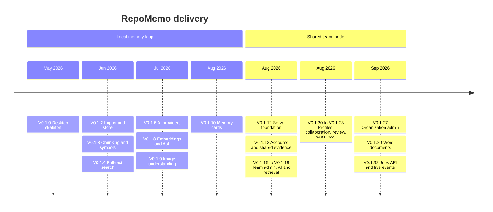

# RepoMemo Roadmap

> **Current version:** `V0.1.32` (2026-09-29)
> **Related:** [Functional mindmap](FUNCTIONAL_MINDMAP.md) · [Technical mindmap](TECHNICAL_MINDMAP.md) · [Implementation tracker](../docs/IMPLEMENTATION_TRACKER.md)

RepoMemo started as a local-first desktop workbench. It has since grown into a **self-hosted team product**: a shared API server with a web client, organizations and roles, collaboration, and optional AI grounded in cited evidence. The original local memory loop (Phase 1) is complete. A large part of the originally "later" team-server phase has also shipped, in a lighter form than first planned: SQLite instead of PostgreSQL, and in-process work instead of a job queue.

The current focus is **moving heavy work off the request path** (background jobs and live progress), then **hardening** and **parity** before growing connectors.

---

## At a glance

| Stage | Status |
|---|---|
| Phase 1: Local memory loop (1A–1H) | ✅ Complete |
| Phase S: Shared team mode | ✅ Core complete · 🔄 background jobs in progress |
| Repository indexing (git) | 🔄 Phase 1 (local repositories) delivered · phases 2–3 planned |
| Next: Jobs, hardening, parity | 🔜 Planned |
| Later: Git awareness, connectors, scale, enterprise | 💭 Direction |

---

## ✅ Delivered

### Phase 1: Local memory loop (desktop)

The goal was to run the whole local loop with AI kept optional: *create workspace → import → inspect → search → ask with citations → save memory*.

| Phase | Version | Delivered |
|---|---|---|
| 1A Skeleton | V0.1.0 | Tauri + React shell, Rust workspace, SQLite schema, workspaces |
| 1B Import and store | V0.1.2 | File and folder import, content-addressed blob store, artifacts view, ADRs 0002–0004 |
| 1C Chunking | V0.1.3 | Markdown chunking by heading, 100-line windows for code and text, indexing jobs. Code chunking became structure-aware (declarations, scope in the heading) afterwards |
| 1E Code symbols | V0.1.3 | tree-sitter symbols for TS/TSX/JS, Python and Rust, file outlines |
| 1D Full-text search | V0.1.4 | SQLite FTS5, safe query building, filters, highlighted snippets |
| 1F AI provider layer | V0.1.6–0.1.7 | Ollama (local) and OpenRouter (cloud, with explicit acknowledgement), cited summaries |
| 1G Semantic search and Ask | V0.1.8 | Local embeddings, hybrid retrieval, cited answers, "insufficient context" guard |
| Image understanding | V0.1.9 | Vision-provider descriptions make images searchable |
| 1H Memory cards | V0.1.10 | Durable cards with evidence links, search and Markdown export |

The detailed specs are in [docs/phases/](../docs/phases) and the status of each area is in the [implementation tracker](../docs/IMPLEMENTATION_TRACKER.md).

### Phase S: Shared team mode (server + web)

This phase took the original "Phase 4: Team Server" and delivered it incrementally on the existing Rust core and SQLite.

| Milestone | Version | Delivered |
|---|---|---|
| Server foundation | V0.1.12 | `repomemo-server` (Axum), health and session routes, worker process boundary |
| Accounts and shared evidence | V0.1.13 | Registration and login (Argon2 + JWT), organizations, workspaces, text evidence, indexing, search, memory, and the **web client** |
| File uploads | V0.1.14 | Upload of evidence files up to 10 MiB |
| Workspace membership | V0.1.15 | Add, change and remove members, with role rules |
| Workspace admin and AI | V0.1.16 | Rename and delete, capabilities, per-workspace AI providers, AI overview, activity log |
| Ask in shared mode | V0.1.17 | Cited Q&A, provider test, memory search |
| Retrieval depth | V0.1.18–0.1.19 | Artifact query filters, retrieval facets (type, language, source) |
| Profiles and metrics | V0.1.20 | User profile, password change, "workspace pulse" metrics |
| Collaboration | V0.1.21 | Task board, evidence comments, assigned tasks, activity calendar |
| Review and notifications | V0.1.22 | Evidence lifecycle (verified, outdated, superseded) with history, notifications, @mentions |
| Workflow depth | V0.1.23 | Saved searches, task checklists |
| Web experience | V0.1.24–0.1.29 | Dashboard, organization switcher, notifications page, profile page, workspace sections, grid and list evidence views |
| Organization administration | V0.1.27 | Organization rename and member management, with access flowing to all org workspaces |
| Word documents | V0.1.30–0.1.31 | `.doc`/`.docx` text extraction, indexing, Documents section with preview |
| Jobs API and live events | V0.1.32 | Job kinds, cooperative cancel, job listing, **SSE event stream** for job and activity events |

---

## 🔄 In progress: background jobs and live progress

V0.1.32 laid the groundwork: a jobs table with a kind and a cancel flag, the jobs endpoints, and a per-workspace SSE stream. The remaining steps are:

- [x] **Automatic indexing after save.** Notes and uploads are queued and indexed in the background by the server, with restart recovery. Stored chunks are visible to owners and admins only, in a dialog. The queue is in-process, so the items below still apply for a durable, scalable version.
- [ ] **Worker claims jobs.** `repomemo-worker` polls or claims queued jobs so indexing no longer runs inside the HTTP request.
- [ ] **Async index endpoints.** `POST …/index` returns a queued job immediately.
- [ ] **Live progress in the web client.** Consume the SSE stream with a fetch-based reader, because a native `EventSource` cannot send the auth header. Show progress bars and a cancel button.
- [x] **Incremental re-index.** Workspace indexing skips artifacts already indexed by the current indexer version, unchanged chunks keep their identity (and embeddings), and a version bump refreshes older indexes in the background.

---

## 🔄 In progress: repository indexing

A git repository is connected as a **living source** instead of being uploaded file by file. Each sync reads what the branch has committed and applies only the difference, keeping every file's identity (comments, memory links, lifecycle) across edits and renames. Design and limits: [technical/repository-sources.md](technical/repository-sources.md).

- [x] **Phase 1: local repositories and the sync engine.** `crates/git` (read-only git CLI), file rules with include/exclude patterns, the `repo_files` table (migration 0017), snapshot sync by git blob id with exact-rename detection, removed files kept but dropped from search, lifecycle changes on edit and removal, one `repo_sync` job per sync with progress and cancel, repository links as a **per-workspace setting** with an access check before linking, resync at server start, the **Repositories** section and **Settings › Repositories** in the web client, and each repository as **one evidence item** whose page shows a content overview (no AI) and an on-request, cited AI summary.
- [ ] **Phase 1b: polish.** ~~Automatic sync when the branch moves~~ (done: branches are polled and synced when they move), renames with edits (`git diff -M`), commit shown on search results and citations, Tauri commands so the desktop app gets the same section. Repository links can be restricted to operator-chosen folders (`REPOMEMO_REPO_ROOTS`).
- [ ] **Phase 2: remote repositories.** Connect by URL with an encrypted token, partial bare clone under the data directory, scheduled fetch, `https`/`ssh` only.
- [ ] **Phase 3: git awareness.** Last author and date per file, `CODEOWNERS` ownership hints, commit-pinned citations, push webhooks, issue and pull-request links.

---

## 🔜 Next (proposed priorities)

These items come from the gaps and risks recorded in the mindmaps. The order is a proposal and is open for discussion.

| # | Theme | Items | Why |
|---|---|---|---|
| 1 | **Security hardening** | ✅ Encrypt provider API keys at rest · ✅ refresh tokens and revocation (session versions: a password change or "sign out everywhere" ends every session) · ✅ a workspace AI policy and per-user AI quotas · ✅ sign-in throttling and lockout · ✅ provider-URL and repository-path guards · ✅ security headers. Next: shared rate-limit counters if the server is scaled out, typed errors | Done; see the [technical mindmap](TECHNICAL_MINDMAP.md#11-risks-and-technical-debt-ranked) for what remains |
| 2 | **Semantic search in shared mode** | Expose embedding builds as a job · embedding model setting · an embedding-capable cloud option | Ask in shared mode is keyword-only today |
| 3 | **Web UX correctness** | Render AI answers as Markdown · render search highlights · handle session expiry gracefully · multi-citation memory cards · multi-file and folder upload | Visible rough edges in daily use |
| 4 | **Onboarding** | Email invitations for people without an account · password reset | People can only be added after they register |
| 5 | **Code health** | Split `SharedWebApp.tsx` by route · adopt a router and a data-fetching cache · frontend tests · typed API errors (404 instead of 400) | The web client is about 2k lines in one file and has no tests |
| 6 | **Data hygiene and performance** | ✅ Blob garbage collection and background maintenance · SQL-side metrics · batched dashboard metrics · indexed vector search | Several endpoints scan everything in memory |
| 7 | **Docs** | Grow the mindmap branch pages · refresh `PRODUCT.md` · single up-to-date API collection | Keep the documentation trustworthy |

---

## 💭 Later: strategic direction

These carry over from the original roadmap and are still valid:

| Direction | Scope |
|---|---|
| **Git-aware indexing** | Started: local repositories sync by commit (see *In progress* above). Still to come: remote repositories, ownership hints and commit/PR relationships |
| **Issue and PR connectors** | GitHub/GitLab first, then Linear/Jira. Link issues and PRs to artifacts and symbols |
| **Scale-out team server** | PostgreSQL, object storage, a durable job queue, and Qdrant when vector search needs a service (see [ADR-0004](../docs/decisions/0004-embedded-vector-storage-before-qdrant.md)) |
| **Enterprise / hosted** | SSO, permission-aware retrieval, audit export, policy controls and redaction, hosted and self-hosted deployment |

---

## Guiding rules (unchanged)

- **Storage first, AI second.** Every AI feature operates on indexed, inspectable evidence and returns citations.
- **Useful without AI.** Storing, browsing, indexing and search must keep working with no provider configured.
- **Cloud is explicit.** No content leaves the server until an admin enables a cloud provider and acknowledges it.
- **Show state.** Storage, indexing progress, provider status and errors are always visible.
