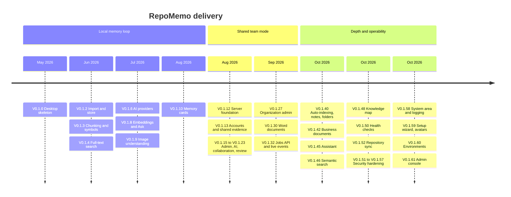

# RepoMemo Roadmap

> **Current version:** `V0.1.61` (2026-10-09)
> **Related:** [Functional mindmap](FUNCTIONAL_MINDMAP.md) · [Technical mindmap](TECHNICAL_MINDMAP.md) · [Implementation tracker](../docs/IMPLEMENTATION_TRACKER.md)

RepoMemo started as a local-first desktop workbench. It is now a **self-hosted team product**: a shared API server with a web client, organizations and roles, collaboration, git repositories as living sources, business documents, and optional AI grounded in cited evidence. A server can be installed and administered entirely from the browser (environment menu, first-run setup, System area, admin console).

Between V0.1.32 and V0.1.61 the work went into **depth and operability**. Background indexing, semantic search, the assistant, the knowledge map, health checks, repository sync, security hardening and the System area all shipped. The first follow-up, **daily-use polish and live progress**, is now built and waiting for the next release (see *In progress*). The proposed focus after it is **onboarding**, then **remote repositories**.

---

## At a glance

| Stage | Status |
|---|---|
| Phase 1: Local memory loop (1A–1H) | ✅ Complete |
| Phase S: Shared team mode | ✅ Complete |
| Phase D: Depth and operability (V0.1.33–V0.1.61) | ✅ Complete |
| Repository indexing (git) | ✅ Phase 1 (local repositories) · 🔄 1b polish · 🔜 phase 2 remote · 💭 phase 3 git awareness |
| Admin console | ✅ First slice and terminal client · 🔄 follow-ups |
| Daily-use polish and live progress | 🔄 Built, not yet released |
| Next: onboarding, repositories, code health | 🔜 Proposed |
| Later: connectors, scale-out, enterprise | 💭 Direction |

---

## ✅ Delivered

### Phase 1: Local memory loop (desktop)

The goal was to run the whole local loop with AI kept optional: *create workspace → import → inspect → search → ask with citations → save memory*.

| Phase | Version | Delivered |
|---|---|---|
| 1A Skeleton | V0.1.0 | Tauri + React shell, Rust workspace, SQLite schema, workspaces |
| 1B Import and store | V0.1.2 | File and folder import, content-addressed blob store, artifacts view, ADRs 0002–0004 |
| 1C Chunking | V0.1.3 | Markdown chunking by heading, 100-line windows for code and text, indexing jobs |
| 1E Code symbols | V0.1.3 | tree-sitter symbols for TS/TSX/JS, Python and Rust, file outlines |
| 1D Full-text search | V0.1.4 | SQLite FTS5, safe query building, filters, highlighted snippets |
| 1F AI provider layer | V0.1.6–0.1.7 | Ollama (local) and OpenRouter (cloud, with explicit acknowledgement), cited summaries |
| 1G Semantic search and Ask | V0.1.8 | Local embeddings, hybrid retrieval, cited answers, "insufficient context" guard |
| Image understanding | V0.1.9 | Vision-provider descriptions make images searchable |
| 1H Memory cards | V0.1.10 | Durable cards with evidence links, search and Markdown export |

The detailed specs are in [docs/phases/](../docs/phases).

### Phase S: Shared team mode (server + web)

| Milestone | Version | Delivered |
|---|---|---|
| Server foundation | V0.1.12 | `repomemo-server` (Axum), health and session routes, worker process boundary |
| Accounts and shared evidence | V0.1.13 | Registration and login (Argon2 + JWT), organizations, workspaces, text evidence, indexing, search, memory, and the **web client** |
| File uploads | V0.1.14 | Upload of evidence files up to 10 MiB |
| Workspace membership | V0.1.15 | Add, change and remove members, with role rules |
| Workspace admin and AI | V0.1.16 | Rename and delete, capabilities, per-workspace AI providers, AI overview, activity log |
| Ask in shared mode | V0.1.17 | Cited Q&A, provider test, memory search |
| Retrieval depth | V0.1.18–0.1.19 | Artifact query filters, retrieval facets (type, language, source) |
| Profiles and metrics | V0.1.20 | User profile, password change, "workspace pulse" metrics |
| Collaboration | V0.1.21 | Task board, evidence comments, assigned tasks, activity calendar |
| Review and notifications | V0.1.22 | Evidence lifecycle (verified, outdated, superseded) with history, notifications, @mentions |
| Workflow depth | V0.1.23 | Saved searches, task checklists |
| Web experience | V0.1.24–0.1.29 | Dashboard, organization switcher, notifications page, profile page, workspace sections, grid and list evidence views |
| Organization administration | V0.1.27 | Organization rename and member management, with access flowing to all org workspaces |
| Word documents | V0.1.30–0.1.31 | `.doc`/`.docx` text extraction, indexing, Documents section with preview |
| Jobs API and live events | V0.1.32 | Job kinds, cooperative cancel, job listing, **SSE event stream** for job and activity events |

### Phase D: Depth and operability (V0.1.33–V0.1.61)

| Milestone | Version | Delivered |
|---|---|---|
| Automatic and incremental indexing | V0.1.33–0.1.40 | Notes and uploads are indexed in the background with retries (30 s, 2 min, 10 min) and restart recovery. Failure reasons are stored and shown (migration 0012). Unchanged chunks keep their identity and embeddings. An `INDEXER_VERSION` bump refreshes older indexes. Code chunking follows declarations |
| Notes and folders | V0.1.40 | TipTap rich-text notes stored as Markdown, nested evidence folders up to 5 levels (migration 0013) |
| Business documents | V0.1.42–0.1.43 | Excel, PowerPoint, PDF, OneNote and Outlook text extraction and previews. Signed "Open in Office" links. Layout-accurate PDF previews through LibreOffice when installed |
| Workspace assistant | V0.1.45 | Closed capability router (find files, search, summarize, ask, overview) with stored per-user conversations (migration 0014) |
| Semantic search in shared mode | V0.1.46 | Embedding providers (Ollama, OpenRouter), a background embedding queue, hybrid FTS + vector search with rank fusion in Retrieval, Ask and the assistant, and an LLM rerank in Ask |
| Knowledge map | V0.1.48 | Indexing pipeline, coverage per kind, and a relation graph of similar files and memory-card citations |
| Workspace health | V0.1.50 | Deterministic checks (older versions, duplicates, removed symbols still mentioned, outdated references, failed indexing, unconnected files), each with actions and recorded outcomes (migration 0015) |
| Repository sync, phase 1 | V0.1.52–0.1.56 | Local git repositories as living sources (migration 0017). The branch is polled and synced when it moves. One evidence item per repository with a content overview, stack detection and an on-request cited AI summary |
| Security hardening | V0.1.51–0.1.57 | Rotating refresh tokens, session versions and "sign out everywhere", encrypted provider keys, sign-in throttling and lockout, workspace AI policy and per-user quotas, provider-URL and repository-root guards, security headers, typed 404s, blob garbage collection and hourly maintenance (migrations 0016, 0018) |
| System area | V0.1.58 | Overview, usage, users, run-time settings, logs (live and daily files, per-category levels), jobs and maintenance, audit trail (migration 0019) |
| Setup, avatars, app administrators | V0.1.59 | First-run setup wizard with a one-time code, profile pictures, app administrators without wildcard access (migrations 0020–0022) |
| Environment folders | V0.1.60 | Choose, create, verify and detach data environments under `workspace-data/` from the browser |
| Admin console | V0.1.61 | System › Console and the `repomemo-console` terminal client, with dry runs and audited changes |

---

## 🔄 In progress

### Daily-use polish and live progress (unreleased)

Built after V0.1.61 and waiting for the next release.

- [x] **AI output as Markdown.** Ask answers, the AI overview and memory card statements are rendered with `react-markdown`. Ask answers are labelled as AI-generated, and their sources are numbered to match the `[1]`, `[2]`… markers. Each source opens its file.
- [x] **Search highlights.** The matched words in search snippets are highlighted. Only the server's `<mark>` tags become highlights, and the rest stays plain text.
- [x] **Several citations per memory card** in the Memory form.
- [x] **Save as memory.** An Ask answer or the AI overview can be saved as a memory card, with a choice of which cited passages become its evidence links.
- [x] **Several files and whole folders.** Choose several files at once, or a folder in the Evidence view. Its subfolders become evidence folders, up to the depth limit, and hidden, dependency and build folders are skipped. Unsupported and oversized files are left out with a notice. Three uploads run at a time with a progress bar.
- [x] **Live progress.** A fetch-based event-stream reader (`lib/liveEvents.ts`) reconnects with a fresh token. It feeds the evidence ledger (files appear and finish indexing as it happens, including other people's), the artifact page, the repository list and page (sync progress), task and memory lists, and the activity feed. A status strip in the ledger shows files still indexing, and embedding and repository jobs with a Stop button. The System jobs page follows every workspace through the new `GET /v1/system/events`. While the stream is down, the previous polling takes over.
- [ ] Not included: changing the citations of an existing memory card (the update API does not take citations yet), and live updates for the knowledge map.

### Repository indexing

Design and limits: [technical/repository-sources.md](technical/repository-sources.md).

- [x] **Phase 1: local repositories and the sync engine.** Includes automatic sync when the branch moves, `REPOMEMO_REPO_ROOTS` and the UNC guard.
- [ ] **Phase 1b: polish.** Renames with edits (`git diff -M`, a renamed *and* edited file currently loses its history), the commit shown on search results and citations, and Tauri commands so the desktop app gets the same section.
- [ ] **Phase 2: remote repositories.** Connect by URL with an encrypted token, partial bare clone under the data directory, scheduled fetch, `https`/`ssh` only.
- [ ] **Phase 3: git awareness.** Last author and date per file, `CODEOWNERS` ownership hints, commit-pinned citations, push webhooks, issue and pull-request links.

### Admin console

Design and open questions: [technical/admin-console.md](technical/admin-console.md).

- [x] **First slice** and the **terminal client** (`repomemo-console`).
- [ ] **Live logs.** `logs --follow` over a system-wide event stream.
- [ ] **Workspace commands.** `workspace reindex`, `repo sync`, `embeddings rebuild`, once the role rule for app administrators is decided.
- [ ] **Personal admin tokens** so scripts do not need a browser access token.

### Background jobs (re-scoped)

- [x] Automatic background indexing, embedding and repository-sync queues with restart recovery, retries and failure reasons.
- [x] Incremental re-index.
- [x] **Live progress in the web client.** Done, see *Daily-use polish and live progress* above.
- [ ] **Async manual index endpoints.** `POST …/index` still runs inside the request. The web client uses it only for the admin re-index of one artifact, so this is minor.
- [ ] **Worker claims jobs.** Moved to *Later (scale-out)*. The in-process queues are working well enough, and a separate worker only pays off with a shared job store.

---

## 🔜 Next (proposed priorities)

These come from checking the code at V0.1.61 against the gaps recorded in the mindmaps. The order is a proposal.

| # | Theme | Items | Why now | Size |
|---|---|---|---|---|
| 1 | **Onboarding without an account** | Invitation links for people without an account (email optional, so it works with no mail server), and a password reset issued by an administrator as a one-time link. SMTP delivery can follow as a System setting | People can only be added after they register, and a forgotten password needs an operator | M |
| 2 | **Repositories phase 1b → phase 2** | Finish rename-with-edit and the commit on citations, then remote repositories by URL | The most valuable product step after polish: most teams' code is not on the server's disk | M → L |
| 3 | **Memory that stays true** | A health check that flags memory cards whose cited passages changed or were removed (repository syncs and re-uploads already record this), with "needs review" on the card | Memory cards are the product's core promise, and today nothing tells you when one goes stale | S–M |
| 4 | **Code health** | Split `SharedWebApp.tsx` (about 200 KB, 2.7k very long lines) by route and section, adopt a router and a data-fetching cache, add frontend tests (Vitest + Testing Library) | Most web work touches this file, and it grew again with the polish and live-progress work. Splitting it first makes the next items cheaper and safer | M |
| 5 | **API and automation** | Personal access tokens (admin console first, then general API use), so scripts and CI can push ADRs, runbooks or release notes as evidence | It unlocks the console follow-ups and the first integrations without building connectors | M |
| 6 | **Performance** | Indexed vector search (sqlite-vec or an in-memory cache per workspace), SQL-side metrics and `artifacts/query`, one batched dashboard metrics call | Vector search, metrics and the artifact query still scan everything in memory, and the dashboard makes one metrics call per workspace | M |
| 7 | **Operations** | Backup and restore of an environment (consistent SQLite snapshot plus blobs) from the System area and the console, and workspace export as an archive | Self-hosted operators need a supported backup path before trusting the server with real knowledge | M |
| 8 | **Docs** | Bring the functional and technical mindmaps up to V0.1.61 (the assistant, map, health, folders and business documents are missing from the functional map, and its §13 gaps are out of date), refresh `PRODUCT.md`, grow the branch pages | Keep the documentation trustworthy | S |

**Suggested next sprint:** item 1 (onboarding), with the `SharedWebApp.tsx` split from item 4 done first or alongside.

---

## 💭 Later: strategic direction

| Direction | Scope |
|---|---|
| **Git awareness** | Repository phase 3: ownership hints, commit-pinned citations, push webhooks, commit and PR relationships |
| **Issue and PR connectors** | GitHub/GitLab first, then Linear/Jira. Link issues and PRs to artifacts and symbols |
| **Assistant depth** | Multi-turn context (the model does not see earlier turns today), cross-workspace search for people in several workspaces, a keyboard command palette |
| **Scale-out team server** | PostgreSQL, object storage, a durable job queue claimed by `repomemo-worker`, shared rate-limit counters, and Qdrant when vector search needs a service (see [ADR-0004](../docs/decisions/0004-embedded-vector-storage-before-qdrant.md)) |
| **Enterprise / hosted** | SSO, permission-aware retrieval, audit export, policy controls and redaction, account deletion policy (creator foreign keys currently block it), hosted and self-hosted deployment |

---

## Guiding rules (unchanged)

- **Storage first, AI second.** Every AI feature operates on indexed, inspectable evidence and returns citations.
- **Useful without AI.** Storing, browsing, indexing and search must keep working with no provider configured.
- **Cloud is explicit.** No content leaves the server until an admin enables a cloud provider and acknowledges it.
- **Show state.** Storage, indexing progress, provider status and errors are always visible.
