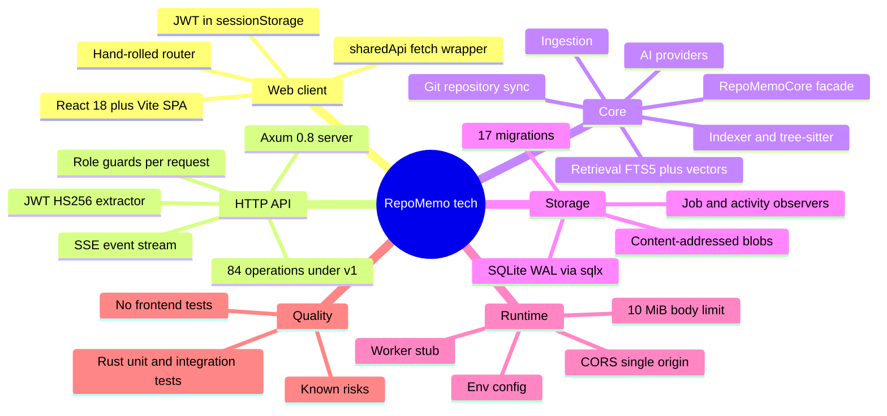
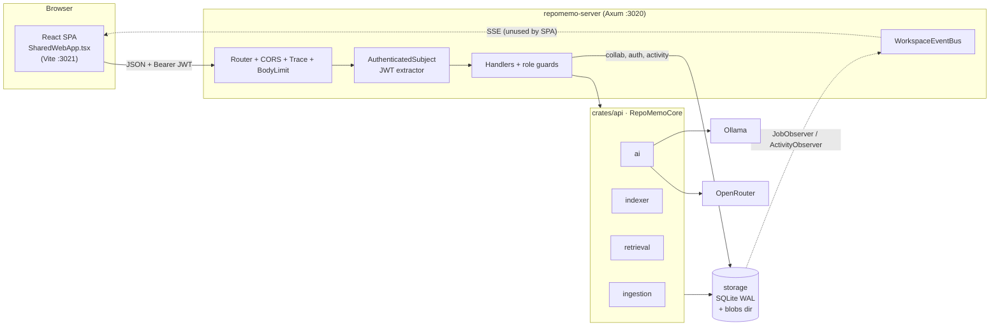
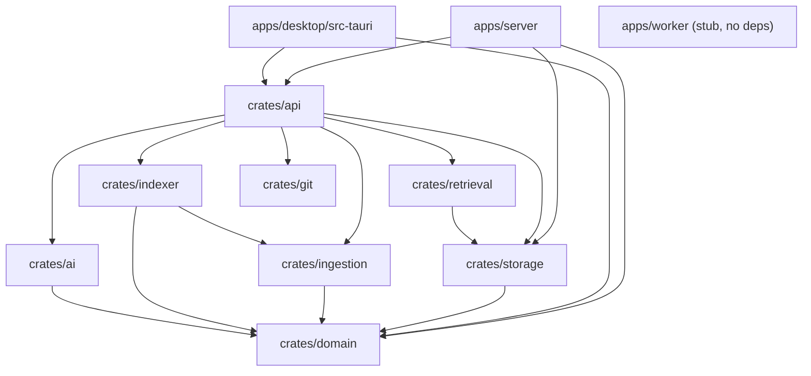
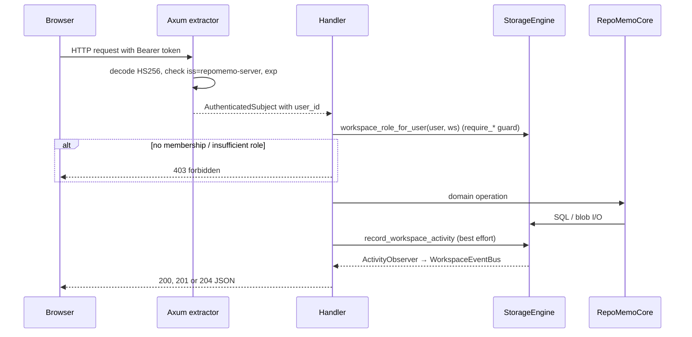
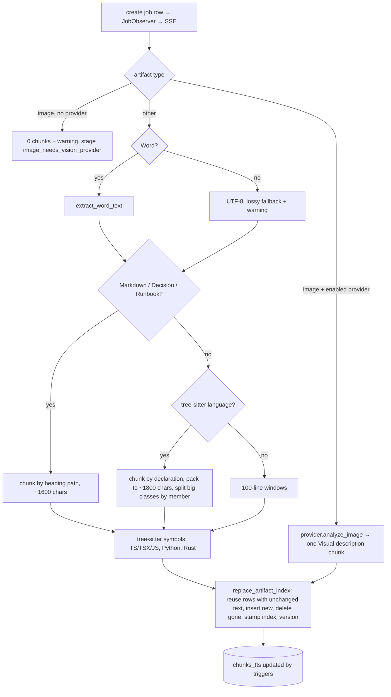
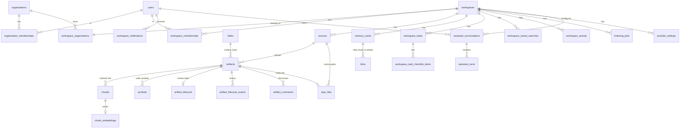

# RepoMemo: Technical Mindmap

> **Audience:** engineers working on RepoMemo, reviewers, and anyone operating the shared server.
> **Companion:** [FUNCTIONAL_MINDMAP.md](FUNCTIONAL_MINDMAP.md) covers *what* the product does. [ROADMAP.md](ROADMAP.md) covers what has shipped and what comes next.
> **Scope:** code at `V0.1.32` (2026-09-29). The focus is the **shared web client** (`apps/desktop/src/SharedWebApp.tsx`) and the **HTTP API** (`apps/server`). Desktop and Tauri paths are noted where they share code.

---

## The mindmap



---

## 1. System context



**The same React bundle has two runtimes.** `apps/desktop/src/App.tsx` checks `"__TAURI_INTERNALS__" in window`:

- In **Tauri**, it renders `LocalDesktopApp`. Rust is reached through `invoke()` (see `lib/repomemoApi.ts`), and 26 Tauri commands call `RepoMemoCore` in-process.
- In a **browser**, it renders `SharedWebApp`, which calls the HTTP API through `lib/sharedApi.ts`.

---

## 2. Workspace layout and crate graph



| Unit | Responsibility | Key file(s) | Size |
|---|---|---|---|
| `crates/domain` | Serde DTOs shared by every layer: `ArtifactSummary`, `Chunk`, `Citation`, `WorkspaceRole`… | [lib.rs](../crates/domain/src/lib.rs) | ~570 LOC |
| `crates/storage` | `StorageEngine`: the sqlx pool, migrations, blob I/O, **all SQL**, observers | [lib.rs](../crates/storage/src/lib.rs), [migrations/](../crates/storage/migrations) | ~4,260 LOC |
| `crates/ingestion` | File discovery, type and language detection, binary sniffing, Word (`.docx` zip/XML, `.doc` CFB) text extraction | [lib.rs](../crates/ingestion/src/lib.rs) | ~650 |
| `crates/indexer` | Chunking (Markdown by heading, structure-aware code chunks for TS/TSX/JS, Python and Rust, 100-line windows as fallback) and tree-sitter symbols. Exports `INDEXER_VERSION` | [lib.rs](../crates/indexer/src/lib.rs) | ~570 |
| `crates/retrieval` | FTS query sanitising, hybrid FTS + vector merge | [lib.rs](../crates/retrieval/src/lib.rs) | ~100 |
| `crates/ai` | `AiProvider` trait, with Ollama and OpenRouter implementations over `reqwest` (rustls) | [lib.rs](../crates/ai/src/lib.rs) | ~530 |
| `crates/git` | Read-only `git` CLI access: resolve a branch, list a commit's tree, stream blobs through `git cat-file --batch` | [lib.rs](../crates/git/src/lib.rs) | ~360 |
| `crates/api` | `RepoMemoCore` facade: import, index, search, summarize, ask, memory cards | [lib.rs](../crates/api/src/lib.rs) | ~1,075 |
| `apps/server` | Axum router, auth, authorization, collaboration handlers, SSE | [lib.rs](../apps/server/src/lib.rs), [events.rs](../apps/server/src/events.rs) | ~4,320 |
| `apps/worker` | Placeholder process. It logs and waits for Ctrl-C, and has **no job claiming** | [main.rs](../apps/worker/src/main.rs) | 30 |
| Web client | SPA, API client, types, layout | [SharedWebApp.tsx](../apps/desktop/src/SharedWebApp.tsx), [sharedApi.ts](../apps/desktop/src/lib/sharedApi.ts), [types.ts](../apps/desktop/src/types.ts), [SharedLayout.tsx](../apps/desktop/src/components/SharedLayout.tsx) | ~3,140 |

**Layering note.** The server calls `RepoMemoCore` for evidence, indexing, search, AI and memory. It calls **`StorageEngine` directly** for auth, organizations, memberships, tasks, comments, lifecycle, notifications, saved searches, activity and jobs. Both use **one shared `StorageEngine`**, created with `RepoMemoCore::from_storage(storage.clone())`, so writes made inside the core still fire the server's observers.

---

## 3. Runtime and configuration

### Server (`ServerConfig::from_env`, [lib.rs](../apps/server/src/lib.rs))

| Env var | Default | Notes |
|---|---|---|
| `REPOMEMO_JWT_SECRET` | — (**required**) | Must be at least 32 characters, or startup panics. |
| `REPOMEMO_SERVER_ADDR` | `127.0.0.1:3020` | Bind address. |
| `REPOMEMO_SERVER_DATA_DIR` | `.repomemo-server` | Holds `repomemo.sqlite` and `blobs/`. The path is relative to the CWD. |
| `REPOMEMO_ALLOWED_ORIGIN` | `http://127.0.0.1:3021` | The **only** CORS origin. Allowed methods are GET, POST, PUT and DELETE. Allowed headers are `Authorization`, `Content-Type` and `X-RepoMemo-Filename`. |
| `REPOMEMO_SERVICE_NAME` | `repomemo-server` | Parsed, but `/health` hardcodes the name, so the value is effectively unused. |
| `RUST_LOG` | `repomemo_server=info,tower_http=info` | Read by the `tracing-subscriber` EnvFilter. |

Tower layers: `TraceLayer`, `DefaultBodyLimit::max(10 MiB)` and `CorsLayer`.

### Web client

| Setting | Where | Value |
|---|---|---|
| `VITE_REPOMEMO_API_URL` | `apps/desktop/.env` | Defaults to `http://127.0.0.1:3020`. |
| Dev server | [vite.config.ts](../apps/desktop/vite.config.ts) | Port `3021`, `strictPort`, started with `npm run web:dev`. |
| Token storage key | `sessionStorage["repomemo.shared.access-token"]` | Scoped to the tab. |
| Theme key | `localStorage["repomemo.theme"]` | |

Run commands are in [docs/DEVELOPMENT_COMMANDS.md](../docs/DEVELOPMENT_COMMANDS.md).

---

## 4. Request lifecycle, authentication and authorization



### Authentication

- Passwords are hashed with **Argon2** (default params and a random salt). The length limit is 12–1024.
- Tokens are **HS256 JWTs** with claims `sub`, `email`, `iss`, `iat` and `exp`. The **TTL is 60 minutes**, and there is **no refresh token and no revocation**. Changing a password does not invalidate tokens that were already issued.
- `AuthenticatedSubject` implements `FromRequestParts`. If a handler takes it as an argument, the handler is protected.
- Login returns the same `invalid_credentials` error whether the email is unknown or the password is wrong.

### Authorization

The server resolves the caller's role **per request** from `workspace_memberships` or `organization_memberships`. Guards return the role, so handlers can apply finer rules.

| Guard | Passes for |
|---|---|
| `require_workspace_read` | any workspace role |
| `require_workspace_write` | owner, admin, member |
| `require_workspace_admin` | owner, admin. Also gates `GET /v1/artifacts/{a}/chunks` |
| `require_workspace_owner` | owner |
| `require_organization_read/admin/owner` | the equivalent roles at org level |

Other rules:

- For **resource-scoped routes** (`/v1/artifacts/{id}`, `/v1/tasks/{id}`, `/v1/comments/{id}`…), the handler first loads the resource to find its `workspace_id` and then applies the guard.
- **Author-or-moderator** checks apply to deleting tasks and to editing or deleting comments.
- **Escalation rules** live in the member-upsert handlers. Nobody can grant `owner`. An admin cannot grant `admin` and cannot modify or remove an owner or admin.
- **Membership propagation** happens in SQL inside storage transactions:
  - `create_shared_workspace` copies all org members into the workspace.
  - `upsert_organization_member` adds the user to every workspace of the org.
  - `upsert_workspace_member` adds the user to the org as a `member` if needed.
- `can_inspect_index` (owner, admin) controls who receives chunks from `GET /v1/artifacts/{a}`. The server strips them for everyone else; the SPA only hides the button and the overview chunk count.
- `GET …/capabilities` returns `capabilities_for_role(role)`. The SPA uses it **only to hide UI**. The server remains the authority.

### Error envelope

```json
{ "error": { "code": "bad_request|unauthorized|invalid_credentials|forbidden|conflict|internal_error", "message": "…" } }
```

`map_storage_error` and `map_core_error` classify `anyhow` errors by **substring matching** on the message. For example, `"was not found"` becomes 400, `"UNIQUE constraint failed"` becomes 409, and anything else becomes 500. **Not-found is reported as 400, not 404.**

---

## 5. HTTP API reference (84 operations)

Guard legend: **pub** = no auth, **auth** = any valid JWT, **R/W/A/O** = workspace read / write / admin / owner, **oR/oA/oO** = organization read / admin / owner. "→ activity" means the call records a `workspace_activity` row and so emits an SSE `activity` event.

### Identity and session

| Method | Path | Guard | Notes |
|---|---|---|---|
| GET | `/health` | pub | `{service,status,authentication}` |
| POST | `/v1/auth/register` | pub | 201 `TokenResponse`, 409 if the email exists |
| POST | `/v1/auth/login` | pub | `TokenResponse`, 401 `invalid_credentials` |
| GET | `/v1/session` | auth | the user and their workspace memberships |
| GET, PUT | `/v1/profile` | auth | GET includes a 365-day `activity_by_day` |
| POST | `/v1/profile/password` | auth | 204. Requires `current_password` |
| GET | `/v1/profile/tasks` | auth | tasks assigned to the caller |
| GET | `/v1/notifications` | auth | |
| POST | `/v1/notifications/read-all` | auth | 204 |
| POST | `/v1/notifications/{id}/read` | auth | scoped to the caller's user_id |

### Organizations

| Method | Path | Guard | Notes |
|---|---|---|---|
| GET, POST | `/v1/organizations` | auth | POST makes the caller owner |
| PUT | `/v1/organizations/{org}` | oO | rename |
| GET | `/v1/organizations/{org}/members` | oR | |
| PUT | `/v1/organizations/{org}/members` | oA | upsert by email and propagate to workspaces |
| DELETE | `/v1/organizations/{org}/members/{user}` | oA | the owner cannot be removed |

### Workspaces, administration and AI

| Method | Path | Guard | Notes |
|---|---|---|---|
| GET | `/v1/workspaces` | auth | the caller's workspaces, with role |
| POST | `/v1/workspaces` | auth + org owner/admin | the org check happens **in storage**, not in a guard |
| PUT, DELETE | `/v1/workspaces/{ws}` | O | rename → activity. DELETE cascades through FKs |
| GET | `/v1/workspaces/{ws}/overview` | R | counts |
| GET | `/v1/workspaces/{ws}/metrics` | R | computed in memory over all artifacts, the last 100 activity rows and members |
| GET | `/v1/workspaces/{ws}/capabilities` | R | role → capability flags |
| POST | `/v1/workspaces/{ws}/ai-overview` | R | returns `provider_configured:false` instead of erroring → activity |
| POST | `/v1/workspaces/{ws}/ask` | R | 400 when no enabled provider → activity |
| GET | `/v1/workspaces/{ws}/knowledge-map` | R | indexing and embedding pipeline counts, coverage per kind of file, and the relation graph (files, memory cards, similar and cites links); see §6.8 |
| GET | `/v1/workspaces/{ws}/agent/capabilities` | R | assistant actions, each flagged `available` against the enabled text provider |
| POST | `/v1/workspaces/{ws}/agent/messages` | R | `{message, capability?, artifact_id?, conversation_id?}` → `{conversation, turn}`. Without `conversation_id` a new chat is started after the reply succeeds. Provider failures come back as reply warnings, not errors. AI-generated replies → activity |
| GET | `/v1/workspaces/{ws}/agent/conversations` | R | the caller's own chats, most recent first |
| GET, PUT, DELETE | `/v1/agent/conversations/{c}` | R + owner | detail with turns / rename `{title}` (1–120) / delete. Another user's chat is a 404 |
| GET, PUT | `/v1/workspaces/{ws}/ai-providers` | A | the response strips `api_key`. PUT upserts and keeps the stored key if the body omits it |
| POST | `/v1/workspaces/{ws}/ai-providers/{p}/test` | A | → activity |
| GET | `/v1/workspaces/{ws}/activity` | A | last 100 |
| GET | `/v1/workspaces/{ws}/activity/calendar` | A | 365 days |
| GET, PUT | `/v1/workspaces/{ws}/members` | A | PUT applies the escalation rules → activity |
| DELETE | `/v1/workspaces/{ws}/members/{user}` | A | → activity |

### Evidence, indexing and jobs

| Method | Path | Guard | Notes |
|---|---|---|---|
| GET | `/v1/workspaces/{ws}/artifacts` | R | |
| POST | `/v1/workspaces/{ws}/artifacts/query` | R | filters by title/path, types, languages, sources and indexed, **in memory** |
| POST | `/v1/workspaces/{ws}/artifacts/text` | W | `{title,content,language?}` → activity. Queues background indexing |
| POST | `/v1/workspaces/{ws}/artifacts/upload` | W | **raw body**, with the name in the `X-RepoMemo-Filename` header and the MIME type in `Content-Type` → activity. Queues background indexing |
| GET, PUT, DELETE | `/v1/artifacts/{a}` | R / W / W | GET returns detail and preview; `chunks` is **empty unless the caller is owner/admin**. Word files are extracted at read time, capped at 120k chars |
| GET | `/v1/artifacts/{a}/chunks` | A | stored chunks of one artifact, for the admin dialog. Members get 403 |
| GET, PUT | `/v1/artifacts/{a}/lifecycle` | R / W | validates status, owner membership and the supersede target → activity |
| GET | `/v1/artifacts/{a}/lifecycle/history` | R | |
| GET, POST | `/v1/artifacts/{a}/comments` | R / W | `@email` mentions → notifications → activity |
| PUT, DELETE | `/v1/comments/{c}` | author or A | → activity |
| POST | `/v1/artifacts/{a}/index` | W | **synchronous** manual re-index. Returns the finished job. The web client only exposes it to admins, in the chunks dialog |
| POST | `/v1/workspaces/{ws}/index` | W | **synchronous**, loops over all artifacts and fails fast. No longer used by the web client |
| GET | `/v1/workspaces/{ws}/jobs?kind&status&limit` | R | default limit 50 |
| GET | `/v1/jobs/{j}` | R | |
| POST | `/v1/jobs/{j}/cancel` | W | sets `cancel_requested`. Cooperative, checked between artifacts or batches |
| GET | `/v1/workspaces/{ws}/events` | R | **SSE** with `job` and `activity` events and a 15 s keep-alive |

### Repositories

| Method | Path | Guard | Notes |
|---|---|---|---|
| GET, POST | `/v1/workspaces/{ws}/repositories` | R / A | list; link a repository and start its first sync |
| POST | `/v1/workspaces/{ws}/repositories/check` | A | checks a link without storing it: readable, a git checkout, branch, commit, files to index |
| GET, PUT, DELETE | `/v1/repositories/{id}` | R / A / A | detail, settings (branch, include, exclude), remove with all its files |
| POST | `/v1/repositories/{id}/sync` | W | queues a background sync (`kind = repo_sync` job). 409 if one is running |
| GET | `/v1/repositories/{id}/files` | R | files in the tree, with index state |

Details, including what each sync does, are in [technical/repository-sources.md](technical/repository-sources.md).

### Retrieval and memory

| Method | Path | Guard | Notes |
|---|---|---|---|
| GET | `/v1/workspaces/{ws}/retrieval-facets` | R | types, languages and sources of **indexed** artifacts |
| POST | `/v1/workspaces/{ws}/search` | R | FTS5 search, see §6.3 |
| GET, POST | `/v1/workspaces/{ws}/saved-searches` | R / W | name ≤120, query ≤500, limit 1–100 → activity |
| DELETE | `/v1/saved-searches/{s}` | W | |
| GET, POST | `/v1/workspaces/{ws}/memory-cards` | R / W | POST validates that each citation belongs to the workspace → activity |
| POST | `/v1/workspaces/{ws}/memory-cards/search` | R | `LIKE %q%` on the title and body |
| GET, PUT, DELETE | `/v1/memory-cards/{m}` | R / W / W | → activity |
| GET | `/v1/memory-cards/{m}/export` | R | `text/markdown` |

### Tasks

| Method | Path | Guard | Notes |
|---|---|---|---|
| GET, POST | `/v1/workspaces/{ws}/tasks` | R / W | validates status, priority, assignee membership and artifact workspace. The assignee is notified → activity |
| GET, PUT, DELETE | `/v1/tasks/{t}` | R / W / creator or A | reassignment sends a notification |
| GET, POST | `/v1/tasks/{t}/checklist` | R / W | body 1–500 |
| PUT, DELETE | `/v1/task-checklist/{i}` | W | `{completed}` |

Postman collections live in `docs/api/`. `RepoMemo-Shared-API_v4` is the newest. That folder is **gitignored**, so the collections exist only in local checkouts and are not on GitHub.

---

## 6. Core pipelines

### 6.1 Ingest (`RepoMemoCore::import_text` / `import_upload`)

```
bytes ─► SHA-256 (hex) ─► store_blob(blobs/<hash-derived path>)  [write-once, INSERT OR IGNORE]
      ─► create_or_get_source(ws, Manual "Pasted notes" | Upload "Shared uploads")
      ─► store_artifact  UNIQUE(workspace_id, source_id, path, content_hash) → dedupe
```

- Upload type detection uses `ingestion::detect_artifact_type` on the extension. An unknown extension produces "This file type is not supported for shared upload".
- For pasted text, the language `Markdown` becomes `markdown_doc`, `Text` or none becomes `file`, and anything else becomes `code_file`.
- **Blobs are never deleted.** Deleting an artifact or workspace leaves orphaned blob files. No GC exists.

### 6.2 Index (`index_artifact` / `index_workspace` → `index_artifact_inner`)



- **Automatic path.** `create_text_artifact` and `upload_artifact` call `IndexQueue::enqueue` ([indexing.rs](../apps/server/src/indexing.rs)) after storing. The queue is an in-process `mpsc` channel with a de-dup set and a semaphore of 2, so at most two artifacts are indexed at once. Each run goes through `RepoMemoCore::index_artifact`, so it still creates a job row (and SSE event) and records an `artifact_indexed` activity. Already-indexed artifacts (duplicate uploads) are skipped.
- **Restart recovery.** `router()` calls `resume_pending()`, which enqueues every artifact with `indexed_at IS NULL`. A failed run leaves the artifact unindexed, so it is retried at the next start. The queue is not durable on its own: it is rebuilt from the database.
- **Retries and failures.** A failed attempt is retried after 30 s, 2 min and 10 min (the permit is released while waiting). After the last retry the reason is stored in `artifact_index_failures` (migration 0012) and served by `GET /v1/workspaces/{ws}/artifacts/index-failures`; the web client shows an alert icon with that message. Saving an enabled vision provider calls `resume_pending()` so waiting images are retried at once. Image indexing first runs the provider's `test_connection`, so an unreachable Ollama or a missing model fails fast with a readable message.
- **Structure-aware code chunks.** For languages with a tree-sitter grammar (TS/TSX/JS, Python, Rust) the file is parsed once and shared with symbol extraction. Top-level declarations become units, comments and attributes stay attached to the declaration below, and units are packed to about 1,800 characters within the same scope. A unit over 3,600 characters is split along its members (class methods, impl items, statements) up to three levels deep, with the enclosing scope stored in `heading_path`, for example `impl Store > save`. Units that cannot be split further are cut by size. Chunks always cover every line exactly once, so citations never point at unowned lines. If there is no grammar or parse tree, the 100-line windows apply.
- **Stable chunk identity.** `replace_artifact_index` matches new chunks to existing ones by content hash. A match keeps its row, so its id, its `chunk_embeddings` row and any `links` to it survive a re-index. Only chunks whose text changed are inserted or deleted. The transaction takes the write lock first (a no-op update) because SQLite fails a read-then-write transaction instantly with `database is locked` when another indexing task commits in between.
- **Index versions.** `INDEXER_VERSION` (currently 2) is stamped on each artifact. `list_artifacts_needing_index` returns artifacts that are unindexed or older than the current version, and skips images that were already indexed. Manual `POST /v1/workspaces/{ws}/index` and the startup sweep both use it, so unchanged evidence is not re-processed. Bump the constant whenever chunking or symbol logic changes. Refreshes do not update `updated_at` and do not write activity entries.
- The manual `POST …/index` endpoints still run **inside the HTTP request**. The worker crate remains a stub.
- `index_workspace` (manual, now unused by the SPA) only processes artifacts that need indexing (see index versions above). It checks `cancel_requested` between artifacts and stops at the first failure with status `failed`.

### 6.3 Keyword search (`RetrievalService::search` → `StorageEngine::search_chunks`)

- `prepare_fts_query` keeps at most 12 tokens and only `[alnum_]` characters. Each token becomes `"tok"*` and the tokens are joined with `AND`. This neutralises FTS operators.
- The SQL does `chunks_fts MATCH ?` with the workspace, type, language and source filters, ranks by `bm25`, and builds snippets with `snippet(…,'<mark>','</mark>',…,24)`. The limit defaults to 40 and is clamped to 1–100.
- The SPA renders `result.snippet` as **plain text**, so the `<mark>` tags appear literally (see §9).

### 6.4 Semantic search ([crates/api/src/embeddings.rs](../crates/api/src/embeddings.rs), [apps/server/src/embedding.rs](../apps/server/src/embedding.rs))

- A workspace may have an **embedding provider** (`metadata.purpose = "embedding"`): Ollama `/api/embed` or OpenRouter `/embeddings`. The suggested model is `bge-m3`, which is multilingual.
- **When chunks are embedded.** The server's `EmbeddingQueue` queues a workspace after each successful indexing, after the embedding provider is saved, and for every workspace at startup. It coalesces requests per workspace and embeds one workspace at a time.
- **What a pass does.** `embed_missing_chunks` embeds every chunk without a vector from the current model, in batches of 32, as an `embedding` job. Unchanged chunks keep their vectors across re-indexing. Changing the model re-embeds everything. Each chunk is embedded as `title > heading` plus its text, cut at 6,000 chars.
- **Search.** `search_workspace` (the Retrieval page and the assistant's Search content) and Ask run `hybrid_search`. It merges keyword (FTS) results and nearest-neighbour results by **reciprocal rank fusion** (k = 60, scores scaled to 0–1). Each list is fetched three times deeper than the limit. Vector search applies the same type, language and source filters and reads only vectors from the current model. If the embedding provider fails, search falls back to keywords only.
- **Desktop.** With no embedding provider, a provider saved without a purpose (the desktop setup) embeds queries instead.
- `GET …/metrics` reports `embedded_chunk_count`, shown as progress in Settings → AI for search.
- ⚠️ Vector search is still a **full scan**: it decodes every vector of the workspace for each query. That is fine for thousands of chunks; beyond that it needs an ANN index (sqlite-vec) or an in-memory cache.

### 6.4b Ask (`RepoMemoCore::ask_workspace`)

1. Uses the workspace's enabled text provider. The query embedding comes from the embedding provider (§6.4).
2. `hybrid_search` in **any-word** keyword mode, retrieving 20 candidates. English and French stopwords are removed and the remaining terms are OR'ed, so a natural question still matches; bm25 ranks passages with more and rarer terms first.
3. If nothing is found, it answers "insufficient" **without calling the provider**.
4. It loads the **full chunk text** of the candidates; search results only carry short snippets.
5. If there are more than 8 candidates, the text provider **reranks** them (`llm_rerank`: listwise, JSON array of indices; indices it leaves out keep their order). A rerank failure becomes a warning.
6. The top 8 passages (each cut at 2,500 chars) go to `generate` as numbered `[1]…[8]`, with a Q&A system prompt that asks the model to cite them. Citations are returned in the same order.

**Summaries.** `summarize_artifact` reads the whole file when its indexed text is at most 14,000 chars. Longer files are summarized part by part: notes on each part of up to 12,000 chars, then one summary written from the notes. At most 8 parts are used, spread evenly, with a warning when parts are skipped.

**Prompts.** `GenerateRequest.system` sets a task-specific system prompt (sent as Ollama `system` or the OpenRouter system message). Ollama requests ask for `num_ctx = 8192` so retrieved context is not cut off silently.

### 6.5 AI overview (`summarize_workspace`)

The overview takes up to 2 chunks per artifact in artifact-list order, stopping at 30 sections or 18,000 chars with each chunk cut at 1,200 chars. It calls `generate` at temperature 0.2 and returns citations for every included chunk.

### 6.6 AI providers ([crates/ai](../crates/ai/src/lib.rs))

| | Ollama | OpenRouter |
|---|---|---|
| generate | `POST /api/generate` | `POST /chat/completions` |
| embed | `POST /api/embed` | ❌ bails ("not configured in Phase 1F") |
| analyze_image | `/api/generate` with images | chat completions with an image part |
| test | `GET /api/tags` | `GET /models` |
| rerank | identity order (stub) | identity order (stub) |

**Two purposes.** A workspace has a *text* provider (answers, overviews, summaries) and a *vision* provider (image to text), distinguished by `metadata.purpose` (`text` by default, so older providers are text providers). Image uploads are refused with a 400 until an enabled vision provider exists (`RepoMemoCore::ensure_upload_allowed`). Image indexing uses the vision provider; for the single-provider desktop setup it falls back to an enabled provider that has no purpose set.

`validate_settings` requires a `name`, an `http(s)` base URL and a model. To **enable** OpenRouter it also requires an `api_key` and `metadata.cloud_content_acknowledged == true`. The HTTP timeout is 45 s.

> ⚠️ **API keys are stored in plaintext** inside `provider_settings.metadata_json.api_key`.

### 6.7 Workspace assistant ([crates/api/src/agent.rs](../crates/api/src/agent.rs))

The assistant is a closed capability router, not a free-running agent. Each message runs exactly one of `find_files`, `search_content`, `summarize_file`, `ask_question` or `workspace_overview`, and each of those wraps an existing core flow.

1. **Routing**, in order. (1) A capability the user picked is used as-is (`routing: explicit`). (2) Keyword rules (`route_by_rules`) recognise common phrasings with no AI (`rules`). (3) If a text provider is enabled, it classifies the message into `{capability, subject}` JSON (`model`). (4) Otherwise the reply lists what the assistant can do (`unmatched`).
2. **File lookup** matches every word against title or path. Kind words such as "pdfs" or "markdown" also match by extension. Results are ranked exact name, then prefix, then contains. A lookup with no name match falls back to a content search.
3. **Summarize** takes an `artifact_id`, or resolves the subject to a single file. When several files match it returns them for the user to pick from.
4. `summarize_file`, `ask_question` and `workspace_overview` need an enabled text provider. Without one they reply that AI is not configured, and nothing is sent.
5. `generated: true` marks text written by the provider, so the UI can label it apart from stored facts.

### 6.8 Knowledge map ([crates/api/src/knowledge_map.rs](../crates/api/src/knowledge_map.rs), Map tab)

`RepoMemoCore::knowledge_map` computes everything per request from existing data; there are no new tables.

- **Pipeline.** Files stored → indexed (or pending, or failed per `artifact_index_failures`) → passages → passages embedded with the current model.
- **Coverage.** The same counts grouped by a readable kind: the artifact type, or the extension for uploaded `file`s (PDF, Word, Excel…).
- **Graph nodes.** The 250 files with the most passages; the rest are counted in `hidden_file_count`. Memory cards that cite a visible file are added too.
- **Similar links.** Each file's centroid is the unit mean of its passage vectors. The pairwise cosine of centroids gives up to 3 neighbours per file, kept only above an adaptive bar: the mean plus a quarter standard deviation of all pairs, never above the 75th percentile. With fewer than 10 pairs a fixed cosine of 0.5 is used instead.
- **Cites links.** Memory card → file, resolving citations of a passage to its file.

The page (`KnowledgeMapPanel`) lays the graph out in the browser with a deterministic force layout (`lib/forceLayout.ts`, about 0.7 s at 280 nodes). Nodes are coloured by 3 file groups from the dataviz reference palette, validated for colour-blind readers in both themes. A table view lists every link.

**Conversations** are stored on the server (migration 0014). `assistant_conversations` holds one row per chat, owned by a single user in a single workspace and visible only to that user. `assistant_turns` holds one row per finished exchange: the label, the request and the full `AgentReply` as JSON. A request that fails leaves no row, and the first message creates the chat only after it gets a reply. A chat is titled from its first request until the user renames it. Turns are snapshots: a file that was deleted later still appears in an old reply, and opening it reports that it is missing. The model does not see earlier turns; each message is still routed and answered on its own. The browser remembers only which chat was last open (`localStorage`).

### 6.9 Workspace health ([crates/api/src/health.rs](../crates/api/src/health.rs), Health tab)

`RepoMemoCore::workspace_health` runs deterministic checks per request over stored facts. No AI provider is called. Files marked `outdated` or `superseded` are retired: they are never reported, but older versions still serve as history.

| Detector | Raised when | Actions |
|---|---|---|
| `older_version_active` | Several uploads share a source and path and more than one is in use | supersede (keep the latest by default), dismiss |
| `duplicate_content` | Files in use share a content hash | supersede (keep the oldest by default), dismiss |
| `removed_symbol_mentioned` | A symbol of a file's previous version is gone from its latest version and from every other file in use, and a non-code file still names it (whole identifier; a plain word only counts when written like code) | needs review, create task, dismiss |
| `outdated_evidence_referenced` | A file in use names a retired file, and no file in use carries that name | needs review, create task, dismiss |
| `index_failed` | `artifact_index_failures` has a row for a file in use | create task, mark outdated, dismiss |
| `unconnected` (info) | With an embedding provider and 8–2,000 embedded files: no similar link (same adaptive bar as the map) and no memory card citation. Skipped when more than 15% of files would qualify | create task, dismiss |

Mentions are found with an FTS5 phrase query, then confirmed on the passage text; at most 200 queries run per check. Each finding has a fingerprint built from the facts behind it. `POST /v1/workspaces/{id}/health/actions` (owners and admins) re-runs the checks, acts only on the finding as it stands now (409 when it changed), applies the change through the evidence lifecycle or the task list, and records the outcome in `workspace_health_actions`. A finding with a recorded outcome stays hidden until its fingerprint changes. Per detector, the page shows how many findings were acted on and how many were dismissed, to show which checks earn their place.

### 6.10 Repository sync ([crates/api/src/repo_sync.rs](../crates/api/src/repo_sync.rs), Repositories tab)

A git repository is a source of `type = 'git_repo'` that is kept in step with what its branch has committed. A sync lists the commit's tree with `git ls-tree`, applies the file rules, compares the result with the `repo_files` rows by git blob id, and applies the difference: new files become artifacts, edited and renamed files update their artifact **in place** (so comments, memory links and lifecycle survive), and files that left the tree keep their artifact but lose their chunks and become `outdated`. Changed files are indexed inside the same job instead of through the per-artifact queue. Repository links are a per-workspace setting (Settings › Repositories), checked by the server before they are stored. Syncs run in the background one at a time ([apps/server/src/repositories.rs](../apps/server/src/repositories.rs)). Full design: [technical/repository-sources.md](technical/repository-sources.md).

---

## 7. Data model

The database is SQLite in WAL mode with foreign keys on, a pool of at most 5 connections, and `sqlx::migrate!` at startup.

| # | Migration | Adds |
|---|---|---|
| 0001 | init | workspaces, sources, blobs, artifacts, chunks + `chunks_fts` (FTS5, external content, triggers), symbols, links, memory_cards, indexing_jobs, provider_settings |
| 0002 | chunk_embeddings | vectors stored as BLOBs (f32 LE) per chunk |
| 0003 | shared_auth | users, organizations, organization_memberships, workspace_organizations, workspace_memberships |
| 0004 | workspace_activity | activity log |
| 0005 | user_profiles | `users.last_connected_at` |
| 0006 | collaboration | workspace_tasks, artifact_comments |
| 0007 | evidence_lifecycle | artifact_lifecycle, artifact_lifecycle_events |
| 0008 | notifications | workspace_notifications |
| 0009 | workflow_depth | workspace_saved_searches, workspace_task_checklist_items |
| 0010 | jobs_kind_cancel | `indexing_jobs.kind`, `cancel_requested` |
| 0011 | index_version | `artifacts.index_version`, the indexer version that produced the current chunks |
| 0014 | assistant_conversations | assistant_conversations, assistant_turns (per-user assistant chats, §6.7) |
| 0015 | workspace_health | workspace_health_actions (what administrators did with each health finding, §6.9) |
| 0017 | repo_files | one row per tracked path of a repository source: its artifact, git blob id, commit and `removed_at` (§6.10) |



Notes:

- `links` is polymorphic: `from_type`/`to_type` are strings without an FK. `delete_artifact` removes the links pointing to the artifact and its chunks explicitly in a transaction.
- Nearly every child table cascades on `workspaces` delete. `created_by_user_id` columns use `ON DELETE RESTRICT`, so **a user who created tasks, checklist items or saved searches cannot be hard-deleted**. No user-deletion route exists yet.

---

## 8. Real-time events

- `WorkspaceEventBus` ([events.rs](../apps/server/src/events.rs)) holds one `tokio::broadcast` channel per workspace, created lazily with capacity 128. Slow consumers lose events, and those losses are silently filtered out of the stream.
- Storage calls `JobObserver::on_job_changed` on every job insert or update, and `ActivityObserver::on_activity_recorded` on every activity row. The bus serialises these as `{"type":"job"|"activity", …}` with the SSE event name set to match.
- **The SPA does not consume this stream or the jobs API.** A browser consumer also cannot use a native `EventSource`, because it cannot send the `Authorization` header. It needs a fetch-based SSE reader, or a token-in-query or cookie scheme.

---

## 9. Web client architecture

| Concern | Implementation |
|---|---|
| Entry | [main.tsx](../apps/desktop/src/main.tsx) loads fonts and CSS, then `App` chooses the runtime |
| Routing | Custom: `navigate()` uses `history.pushState` plus a `popstate` listener, and `pathname.split("/")` is matched by hand in `SharedWebAppContent`. There is no router library |
| Routes | `/login`, `/register`, `/dashboard`, `/profile`, `/notifications`, `/workspaces[?organization=&createOrganization=1]`, `/workspaces/:ws/:section`, `/workspaces/:ws/artifacts/:id`, `/workspaces/:ws/memory-cards/:id`, and a fallback `SharedRouteNotFound` |
| Session | Token in `sessionStorage`. `hydrate()` loads session, organizations and workspaces in parallel on boot. The SPA does not handle 401 after boot, so an expired token shows up as a per-action error |
| State | Local `useState` inside large components (`SharedWorkspaceDetail` has 50+ state hooks). There is no cache or query library. `load()` refetches capabilities, overview, metrics, artifacts, memory and facets, plus section-specific data, after most mutations |
| API client | [sharedApi.ts](../apps/desktop/src/lib/sharedApi.ts) wraps `fetch`, adds `Bearer` and JSON, turns the error envelope into `SharedApiError(status, message)`, and uses `requestText` for Markdown export. It maps camelCase inputs to snake_case bodies |
| Types | [types.ts](../apps/desktop/src/types.ts) mirrors the Rust `domain` DTOs by hand, in snake_case. There is no codegen |
| Layout | `SharedLayout` provides the header, theme, notifications, profile and sign-out, plus a rail (`OrganizationRail`) and a `WorkspaceTopbar` |
| UI kit | Local shadcn-style `Button`, `Input`, `Textarea` and `Dropdown` (Radix Select), with `@tabler/icons-react` |
| Business documents | Word, Excel (`.xlsx`, `.xlsm`, `.xls`), PowerPoint (`.pptx`, `.ppt`), PDF, OneNote (`.one`) and Outlook (`.eml`, `.msg`) are stored as `File` artifacts whose language is the format name. [documents.rs](../crates/ingestion/src/documents.rs) extracts searchable text for the indexer and builds previews (`DocumentPreview`: text, sheets, slides, email, pdf). OOXML is read through the bounded ZIP reader (16 MiB per member); `.xls` uses `calamine`, PDFs `pdf-extract` (panics are caught), `.eml` `mail-parser`, `.msg` and legacy `.ppt` the `cfb` crate. OneNote text is recovered heuristically from UTF-16 runs and is labelled approximate. Endpoints: `GET /v1/artifacts/{id}/document-preview`, `GET /v1/artifacts/{id}/file` (always an attachment, sandboxed), `POST /v1/artifacts/{id}/open-link` (five-minute signed link with its own JWT issuer, so it cannot be used as a session) and the unauthenticated `GET /v1/shared-files/{token}/{filename}`. "Open in ..." uses the Office URL schemes (`ms-word:ofv|u|`, `ms-excel:`, `ms-powerpoint:`, `onenote:`) with that link; PDFs open in a browser tab and Outlook messages are saved for the system to open. Download is always offered. **Layout-accurate previews:** when LibreOffice is installed (found on `PATH`, in its usual install folder, or via `REPOMEMO_SOFFICE`), [conversion.rs](../apps/server/src/conversion.rs) converts Word, Excel and PowerPoint files to PDF once, caches it as `<data dir>/previews/<content hash>.pdf`, and the client shows it in the PDF viewer (`GET /v1/artifacts/{id}/rendered-preview/status` starts and reports the conversion, `GET .../rendered-preview` serves the PDF). Conversions run one at a time with a 120 s timeout (the process tree is killed), a fixed input file name, and a 100 MiB output cap; failures are remembered until the next restart. Uploads start the conversion immediately. Without LibreOffice the extracted-text, table and slide previews are used |
| Notes and folders | Shared notes are stored as `Note` artifacts (`.note` file, Markdown body). The note box is a TipTap WYSIWYG editor ([RichNoteEditor.tsx](../apps/desktop/src/components/RichNoteEditor.tsx)) that emits Markdown. Evidence can be organized in nested **folders** (`folders` table and `artifacts.folder_id`, migration 0013), limited to 5 levels by `MAX_FOLDER_DEPTH`. `GET/POST /v1/workspaces/{ws}/folders`; notes (`folder_id` in the body) and uploads (`X-RepoMemo-Folder-Id` header) can be filed into a folder, and `GET .../artifacts` adds `folder_id` to each item. A duplicate upload never moves an artifact that is already filed. `PATCH .../folders/{id}` renames; `DELETE .../folders/{id}` deletes the folder with every subfolder and file in it (the client confirms first and shows the counts); `PUT /v1/artifacts/{id}/folder` moves a file (`folder_id: null` for the top level); files are deleted with `DELETE /v1/artifacts/{id}`. Folders themselves cannot be moved yet. Cards and rows have a "more actions" menu (Radix dropdown) and confirmations use a Radix dialog |
| Notifications | Errors and success messages are **toasts** (bottom-right, solid status-colored fill with white text, auto-dismissed after ~4.5 s, errors ~7 s), never inline banners. [toast.tsx](../apps/desktop/src/components/ui/toast.tsx) exposes `showToast(kind, message)` and a declarative `<Toast kind message />`; `ToastViewport` is mounted once in `main.tsx` |
| Styling | [styles.css](../apps/desktop/src/styles.css) (~6.1k LOC) plus [blueprint-refinement.css](../apps/desktop/src/blueprint-refinement.css). Design rules are in [DESIGN.md](../DESIGN.md). `docs/design/` also holds design rules, but it is gitignored and exists only locally |
| Rendering of AI output | `answer_markdown` and `summary_markdown` are rendered as **plain text**. `react-markdown` is a dependency but `SharedWebApp` does not use it |
| Fan-out | The dashboard issues **one `/metrics` call per workspace** (`Promise.allSettled`) |

---

## 10. Testing

| Where | Count | What |
|---|---|---|
| `apps/server` | 4 `tokio::test` | End-to-end through the router with `tower::oneshot`: auth protection, the evidence flow, org→workspace role inheritance, and job listing and cancellation |
| `crates/indexer` | 9 | chunking and symbol extraction per language |
| `crates/ingestion` | 5 | detection and Word extraction |
| `crates/ai` | 4 | settings validation |
| `crates/storage` | 4 | storage behaviour |
| `crates/retrieval` | 2 | FTS query sanitising |
| `crates/api` | 1 | |
| Web client | **0** | no unit, component or e2e tests. `npm run typecheck` is the only gate |

Run the Rust tests with `cargo test`. See [DEVELOPMENT_COMMANDS.md](../docs/DEVELOPMENT_COMMANDS.md).

---

## 11. Risks and technical debt (ranked)

| # | Area | Issue | Suggested direction |
|---|---|---|---|
| 1 | Security | Provider API keys are stored in plaintext in SQLite | Encrypt at rest with a server key, or use an OS or secret store |
| 2 | Scalability | Automatic indexing uses an in-process queue with 2 workers, no durable jobs, no retry policy, and the worker crate is a stub. The SPA polls instead of following SSE | Durable job queue claimed by the worker, retries with backoff, SSE progress |
| 3 | Auth | No refresh or revocation, and a password change leaves old tokens valid | Short access token plus refresh, and a token version per user |
| 4 | Cost / abuse | Viewers can trigger Ask and the AI overview, including on cloud providers | A capability flag for AI use, and rate limits |
| 5 | Correctness | Error classification by substring matching, and not-found returns 400 | Typed errors from storage and core |
| 6 | Performance | Vector search scans the whole table in Rust. Metrics and `artifacts/query` load everything into memory. The dashboard makes N+1 metrics calls | ANN or an index (Qdrant is per [ADR-0004](../docs/decisions/0004-embedded-vector-storage-before-qdrant.md)), SQL aggregation, and a batched metrics endpoint |
| 7 | Scale | Vector search scans every embedding of the workspace per query (§6.4) | An ANN index (sqlite-vec) or a per-workspace in-memory vector cache |
| 8 | Storage | Orphan blobs are never garbage-collected | Reference-counted GC job |
| 9 | Frontend maintainability | `SharedWebApp.tsx` ~2k LOC, `App.tsx` ~2.7k, `styles.css` ~6.1k, a hand-rolled router, no tests | Split per route and section, add a router and a query cache, add component tests |
| 10 | UX correctness | Literal `<mark>` in snippets, and Markdown shown as raw text | Render the snippet safely and use `react-markdown` |
| 11 | Data integrity | `ON DELETE RESTRICT` on creator FKs blocks future user deletion | Decide on the account-deletion policy |

---

## 12. Existing documentation status

The table records whether each existing document still matches the code. The mindmap is intended to become the entry point, with these documents as deep references.

| Document | Status vs code |
|---|---|
| [README.md](../README.md) | ✅ Rewritten as the GitHub landing page. It points to `mindmap/` |
| [PRODUCT.md](../PRODUCT.md) | Kept because the **impeccable** design skill reads it (`.agents/skills/impeccable`). Its product content now lives in the [functional mindmap](FUNCTIONAL_MINDMAP.md#who-its-for-and-what-it-stands-for). ⚠️ Its "Operating Context" and constraints still describe a desktop-only product |
| [mindmap/ROADMAP.md](ROADMAP.md) | ✅ Moved from `docs/` and updated to V0.1.32 |
| [docs/IMPLEMENTATION_TRACKER.md](../docs/IMPLEMENTATION_TRACKER.md) | ✅ Phases 1A–1H are accurate. Shared mode and collaboration are not tracked |
| [docs/architecture/RepoMemo_ARCHITECTURE.md](../docs/architecture/RepoMemo_ARCHITECTURE.md) | Original target-architecture brief. Useful for intent, not current state |
| [docs/architecture/SHARED_MODE_IMPLEMENTATION_PLAN.md](../docs/architecture/SHARED_MODE_IMPLEMENTATION_PLAN.md), [TEAM_COLLABORATION_AND_BACKEND_PLAN.md](../docs/architecture/TEAM_COLLABORATION_AND_BACKEND_PLAN.md) | Plans. Partially realised: SQLite, not PostgreSQL, and a stub worker |
| [docs/decisions/](../docs/decisions) | ✅ The ADRs are still valid |
| [docs/phases/](../docs/phases) | Historical specs for the desktop phases |
| [DESIGN.md](../DESIGN.md), `docs/design/` (gitignored) | UI rules. Still the reference for styling |

---

## Branch documents (planned)

This file is the root of the technical mindmap. Each branch can grow into its own page under `mindmap/technical/`:

| Branch | Planned page |
|---|---|
| API reference, with request/response schemas | `technical/api-reference.md` |
| Auth and authorization model | `technical/auth-and-authorization.md` |
| Ingestion and indexing pipeline | `technical/indexing-pipeline.md` |
| Retrieval and Ask internals | `technical/retrieval-and-ask.md` |
| AI provider layer | `technical/ai-providers.md` |
| Data model and migrations | `technical/data-model.md` |
| Events, jobs and the worker | `technical/jobs-and-events.md` |
| Web client architecture | `technical/web-client.md` |
| Operations: config, deploy, backup | `technical/operations.md` |
| Risks and tech-debt register | `technical/tech-debt.md` |
| Repository sources (git) | ✅ [technical/repository-sources.md](technical/repository-sources.md) |
