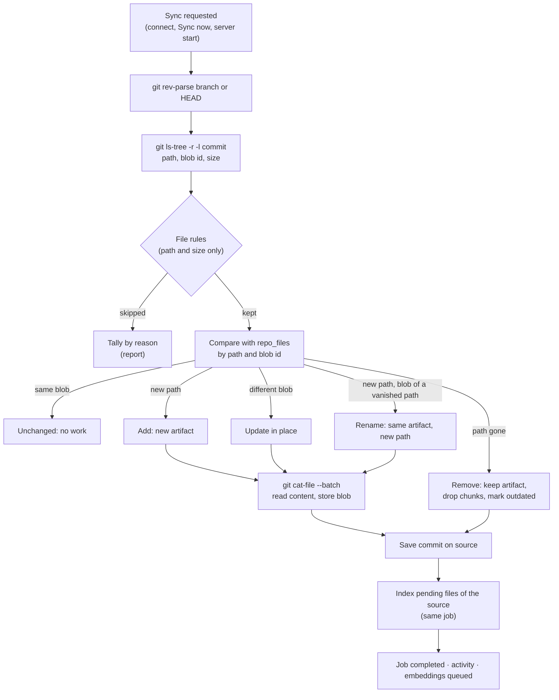

# Repository sources (git)

> **Branch of:** [TECHNICAL_MINDMAP.md](../TECHNICAL_MINDMAP.md) · **Functional view:** [FUNCTIONAL_MINDMAP.md §5b](../FUNCTIONAL_MINDMAP.md#5b-repositories) · **Status:** phase 1 (local path) shipped, see [ROADMAP.md](../ROADMAP.md#-in-progress-repository-indexing)

A repository is not a batch of uploads. It already holds many files, it keeps changing, and git records exactly what changed. RepoMemo therefore treats a repository as a **living source**: it is linked once, and each **sync** brings the workspace in step with what the chosen branch has **committed**.

Repository links are a **per-workspace setting**. Each workspace's owners and administrators add, edit and remove its links in **Settings › Repositories**; there is no server-wide list. Before a link is stored, the server **checks it**: it must exist, the server's account must be able to read it, it must be a git checkout, and the branch must exist. The check also reports the commit and how many files would be indexed.

---

## How to try it locally

1. Start the server as usual (`cargo run -p repomemo-server`). No extra configuration is needed.
2. In the web client, open a workspace as an owner or administrator and go to **Settings › Repositories**.
3. Enter the **repository link**: the folder of a checkout on the server, for example `C:\Users\you\DEVHUB\my-repo`. Any folder inside the repository works, and a quoted path from Explorer's "Copy as path" is accepted. Optionally set a name, a branch and include/exclude patterns.
4. Press **Check access**. The server reports the repository it found, the branch and commit, and about how many files will be indexed, or a toast explains what is wrong (folder missing, no read access, not a git repository, unknown branch, owned by another account).
5. Press **Link and sync**. The first sync starts at once; follow it in the **Repositories** section. Commit something and press **Sync now** to see edits, renames and deletions followed.

`git` must be installed and on the server's `PATH`.

---

## Design in one picture



---

## Key decisions

| Decision | Why |
|---|---|
| **The operator can restrict links to some folders** (`REPOMEMO_REPO_ROOTS`). | A link is checked against the allowed folders before anything is read, again after symbolic links are resolved, and on every sync, so narrowing the setting also stops older links. The repository root git reports must be inside too, since a sync reads the whole repository. Windows network shares (`\\host\share`) are refused unless an allowed folder is on one: just opening a UNC path makes Windows send the server account's credentials to that host. |
| **Read commits, not the working tree.** | What is committed is stable and reviewable. Uncommitted edits, ignored files and build output never enter the index, and `.gitignore` is respected without reimplementing it. |
| **One artifact per path, updated in place** (`repo_files`). | Uploads are unique on `(workspace, source, path, content_hash)`, so re-importing an edited file would create a second artifact and leave the stale one searchable. A repository file keeps its artifact id across edits and renames, so comments, memory links, tasks and lifecycle history stay attached. |
| **Snapshot comparison by git blob id**, not `git diff`. | Comparing the whole tree with the stored `repo_files` rows is always correct, even after a rebase or force-push, and an unchanged file costs nothing because its blob id is unchanged. |
| **Deleted files are kept, not deleted.** | Memory cards and comments may cite them. Their chunks are dropped so search and Ask stop returning code that no longer exists, and their lifecycle moves to `outdated` with a note naming the commit. |
| **The sync indexes its own files in one job** (`kind = repo_sync`). | The per-artifact queue used for uploads would create one job and one activity entry per file. A repository of thousands of files gets one job with progress and cancel instead. |
| **`git` CLI, behind a small crate** (`crates/git`). | The user's own git setup (credential helpers, `safe.directory`, long paths on Windows) applies unchanged. Only read commands are run, with `GIT_OPTIONAL_LOCKS=0`, so a sync never takes a lock in a repository someone is working in. |
| **Links are a workspace setting, checked before they are stored.** | Each workspace decides which repositories it indexes, without a server-wide configuration. The check runs with the server's own account, so "access" means what the server process can read. **Trade-off:** a workspace owner or administrator can link any git checkout that account can read. Run the server under an account that only sees the repositories teams should use. |

---

## Data model

Migration `0017_repo_files`:

| Column | Meaning |
|---|---|
| `source_id`, `path` | Primary key. One row per tracked path of a repository source |
| `artifact_id` | The artifact holding the file (unique) |
| `blob_sha` | Git object id of the content last stored. Equal ids mean equal content |
| `commit_sha` | Commit at which the row was last written |
| `removed_at` | Set when the path left the tree; cleared if it comes back |

The source itself is a `sources` row with `type = 'git_repo'`, `root_uri` = the repository root, and `status` = `pending | syncing | ready | error`. Its `metadata_json` holds:

```json
{
  "settings": { "branch": null, "include": [], "exclude": ["fixtures/"] },
  "last_synced_commit": { "sha": "…", "summary": "…", "author_name": "…", "committed_at": "…", "branch": "main" },
  "last_synced_at": "…",
  "last_error": null,
  "last_report": { "added": 3, "updated": 1, "renamed": 0, "removed": 0, "skipped": 12, "skipped_by_reason": [ … ], "indexed": 4, … }
}
```

A repository artifact's own `metadata_json` records `origin: "git_repo"`, the repository root, the commit and the blob id.

---

## The repository as one evidence item

Besides one artifact per file, each repository has **one artifact that stands for the whole repository** (`type = 'repository'`, path = the repository root, source = the repository source). It is what the Evidence ledger shows for the repository: its files are listed only in the Repositories section, but the repository itself sits next to notes and uploads, with its own lifecycle, comments and memory links.

At the end of every complete sync, [`repo_overview.rs`](../../crates/api/src/repo_overview.rs) computes a **`RepoOverview`** from the stored files, with no AI:

| Part | How it is computed |
|---|---|
| At a glance | Files indexed and total size |
| Languages | Files and bytes per language, by size; the eighth and later are merged into "Other" |
| Structure | Files per top-level folder (root files as "Repository root"), the 12 largest |
| Key files | Root README, manifests (`Cargo.toml`, `package.json`, `pyproject.toml`, `go.mod`, `Dockerfile`, …), entry points (`main.rs`, `index.ts`, `App.tsx`, `main.go`, …) and root or `docs/` Markdown. At most 2 READMEs, 5 manifests, 6 entry points and 4 docs, shallowest first |
| From the README | The opening (~1,800 characters) of the root README, cut at a paragraph, with HTML tags and images removed |
| Recent commits | The last 10 commits of the branch (`git log`) |

The overview is kept in the source's `metadata_json` (`overview`, `overview_artifact_id`) and rendered as **Markdown** into the artifact's content, which is indexed with the files, so questions about the repository as a whole ("what is this repository?") find it. The Markdown carries no timestamp of its own, so its content hash, and therefore its index, only change when the repository does. The artifact is created on the first sync and updated **in place** afterwards; renaming the repository renames it, and removing the repository deletes it.

**Summary (optional AI).** On the repository page, a member who can write can generate a summary when the workspace has an enabled text provider. The prompt gets the overview Markdown plus the first passages of up to 8 key files (about 16,000 characters in total, 4,000 per file), and asks for what the repository is, its main parts, technologies, how to build or run it (only if stated) and where to start reading. The result is kept in the source's metadata with the provider name, the commit it describes and its citations, until someone regenerates it; the page says when the repository has moved on since. Nothing is sent to a provider unless someone asks.

**Views that relate files to each other treat the repository as this one item.** The knowledge map draws one node per repository (sized by all its files' passages, placed by their average meaning, linked to memory cards that cite any of its files) instead of one node per file, and the health checks for duplicates and unconnected files compare the repository as a whole. Without this, linking two front-end repositories put more than 300 code files on the map. Indexing progress and coverage still count every file, under "Repository files".

**The page** (`RepositoryDetailView`, shown on the artifact page of a `repository` item): sync state with Sync now / Stop and a file browser, the summary, and the content overview (language and structure tables, key files that open their evidence, the README opening, recent commits), followed by the usual lifecycle and discussion panels. Renaming or deleting the item through the artifact routes is refused like for repository files.

---

## Which files are indexed

Implemented in [`crates/ingestion/src/repo.rs`](../../crates/ingestion/src/repo.rs). Rules are decided from the path and the size git reports, before any content is read.

1. Only regular files of the commit's tree. Symbolic links and submodules are skipped.
2. **Include** patterns, when set: a file must match one.
3. **Default excludes**: `node_modules/`, `vendor/`, `dist/`, `build/`, `target/`, `.next/`, `.vite/`, `coverage/`, `__pycache__/`, lock files (`package-lock.json`, `yarn.lock`, `pnpm-lock.yaml`, `Cargo.lock`, `poetry.lock`, `Pipfile.lock`, `composer.lock`, `Gemfile.lock`, `go.sum`), `*.min.js`, `*.min.css`, `*.map`. Then the source's own **exclude** patterns.
4. Files over **1 MB**.
5. **Images** are skipped: repository images are mostly icons, and describing them needs a vision provider.
6. Known types (Markdown, code, config, Office and PDF documents) are kept as their usual artifact types. Other extensions common in repositories (Go, Java, Kotlin, C/C++, C#, Ruby, PHP, Swift, Vue, Svelte, XML, SCSS, GraphQL, Protocol Buffers, Terraform, `Dockerfile`, `Makefile`, …) become code files. Anything else is kept only if its content is UTF-8 text without NUL bytes.

**Pattern syntax** (gitignore-like): `name` or `*.ext` matches a file name at any depth; `dir/` matches everything under a directory of that name; anything with a `/` is matched against the whole path, where `*` and `?` stay within one segment and `**` spans segments (`docs/**`, `**/*.test.ts`).

---

## Lifecycle effects

Syncs change an artifact's lifecycle only from statuses a person would expect, so a reviewer's decision is not overwritten. These changes have no actor and appear as **System** in the lifecycle history.

| Event | From | To |
|---|---|---|
| A file's content changed | `verified` | `needs_review`, note "Changed in the repository at commit …" |
| A file left the tree | `active`, `needs_review`, `verified` | `outdated`, note "Removed from the repository at commit …" |
| A removed file came back | `outdated` | `active` |

---

## HTTP API

| Method | Path | Guard | Notes |
|---|---|---|---|
| GET | `/v1/workspaces/{ws}/repositories` | R | `{ repositories }` |
| POST | `/v1/workspaces/{ws}/repositories/check` | A | `{ link, branch?, include[], exclude[] }`. Stores nothing. Returns `RepoAccessCheck`: `root_path`, `name`, `commit` (with branch), `tracked_files`, `indexable_files`, `already_connected`. 400 with a readable reason when the server cannot use the link |
| POST | `/v1/workspaces/{ws}/repositories` | A | `{ link, name?, branch?, include[], exclude[] }` (`path` is accepted as an alias of `link`). Runs the same checks, stores the link and starts the first sync. 201 with `{ repository, job }`; 409 if already linked |
| GET | `/v1/repositories/{id}` | R | One `RepoSource`, with counts and the running job, if any |
| PUT | `/v1/repositories/{id}` | A | `{ name?, branch?, include[], exclude[] }`. Applies from the next sync |
| DELETE | `/v1/repositories/{id}` | A | Deletes the source, its artifacts, chunks and memory links. 409 while syncing. The repository on disk is not touched |
| POST | `/v1/repositories/{id}/sync` | W | Queues a sync. 409 if one is running |
| GET | `/v1/repositories/{id}/files` | R | Files currently in the tree, with index state |
| GET | `/v1/repositories/{id}/detail` | R | `RepoDetail` for the repository page: `repository` (including `overview_artifact_id`), `overview`, `summary`, and `ai_available` (an enabled text provider exists) |
| POST | `/v1/repositories/{id}/summary` | W | Generates and keeps the AI summary. 400 when no text provider is enabled ("No content was sent") or the repository was never synced |

Progress uses the existing jobs API (`kind = repo_sync`, stages `queued → reading_repository → storing_files → indexing`) and `POST /v1/jobs/{id}/cancel`. Repository artifacts appear in `GET /v1/workspaces/{ws}/artifacts` with a `repository_id`. Renaming or deleting one through the artifact routes is refused with 400, because the next sync would undo it.

Syncs run in the background, one at a time across the server and never two for the same repository ([`apps/server/src/repositories.rs`](../../apps/server/src/repositories.rs)). At startup the server fails syncs a previous process left running and syncs every repository again, which also picks up commits made while it was down.

---

## Code map

| Piece | File |
|---|---|
| Git access (`GitRepo`, `BlobReader`) | [crates/git/src/lib.rs](../../crates/git/src/lib.rs) |
| File rules and patterns | [crates/ingestion/src/repo.rs](../../crates/ingestion/src/repo.rs) |
| `repo_files` storage, lifecycle changes | [crates/storage/src/repo.rs](../../crates/storage/src/repo.rs), [0017_repo_files.sql](../../crates/storage/migrations/0017_repo_files.sql) |
| Sync engine (`connect_local_repo`, `run_repo_sync`, …) | [crates/api/src/repo_sync.rs](../../crates/api/src/repo_sync.rs) |
| Overview and summary (`compute_overview`, `overview_markdown`, `summarize_repo`) | [crates/api/src/repo_overview.rs](../../crates/api/src/repo_overview.rs) |
| Domain types (`RepoSource`, `RepoSyncReport`, `RepoFile`) | [crates/domain/src/lib.rs](../../crates/domain/src/lib.rs) |
| HTTP routes and background runner | [apps/server/src/repositories.rs](../../apps/server/src/repositories.rs) |
| Web UI: Repositories section (`RepositoriesPanel`), Settings › Repositories (`RepositorySettings`) and the repository page (`RepositoryDetailView`) | [RepositoriesPanel.tsx](../../apps/desktop/src/components/RepositoriesPanel.tsx) |

Tests: `repomemo-git` (tree parsing, reading a real repository), `repomemo-ingestion` (patterns and classification), `repomemo-api` (`syncs_follow_commits_and_keep_artifact_identity`: add, edit, rename, delete, search, the repository item and its overview, remove; plus overview and README-excerpt unit tests) and `repomemo-server` (`workspace_repository_links_are_checked_then_synced_in_the_background`: roles, link checks for URLs, missing folders and non-repositories, background sync, refused edits, the repository item, its detail and a cited AI summary through a fake Ollama).

---

## Known limits of phase 1

- **Renames are detected only when the content is identical.** A file renamed and edited in the same commit becomes a removal plus an addition, so its comments stay on the old, now outdated, artifact.
- **Syncs follow the branch by polling.** Every `REPOMEMO_REPO_POLL_SECONDS` (300 by default; `0` turns it off) the server resolves each branch with one `git rev-parse` and syncs the repositories whose branch moved. A sync towards the same commit is not retried within an hour, and a repository that never synced successfully waits for someone to press Sync now. There is no file watching.
- **Local folders only.** A link is a folder on the server; remote URLs are refused with a clear message. URLs, credentials and webhooks are phase 2, and will reuse the per-workspace link and its access check (with a per-workspace token).
- **One branch per repository.** A repository root can be connected only once per workspace, so two branches of it cannot be indexed side by side yet.
- The desktop app does not have the Repositories section yet; the engine is in `RepoMemoCore` and can be exposed through Tauri commands.
- Search results do not show the commit yet, and citations are not pinned to a commit.

## Next phases

1. **Phase 1b, polish:** automatic sync when the branch moves (a cheap `rev-parse` poll), similarity-based renames via `git diff -M` when the last commit is reachable, a commit badge on search results, Tauri commands for the desktop app.
2. **Phase 2, remote repositories:** connect by URL with an encrypted token, a bare partial clone (`--filter=blob:none`) under the data directory, scheduled fetch, `https`/`ssh` only and `protocol.file.allow=never`.
3. **Phase 3, git awareness:** last author and date per file from one `git log` pass, `CODEOWNERS` as ownership hints, commit-pinned citations, push webhooks, and links to issues and pull requests.
