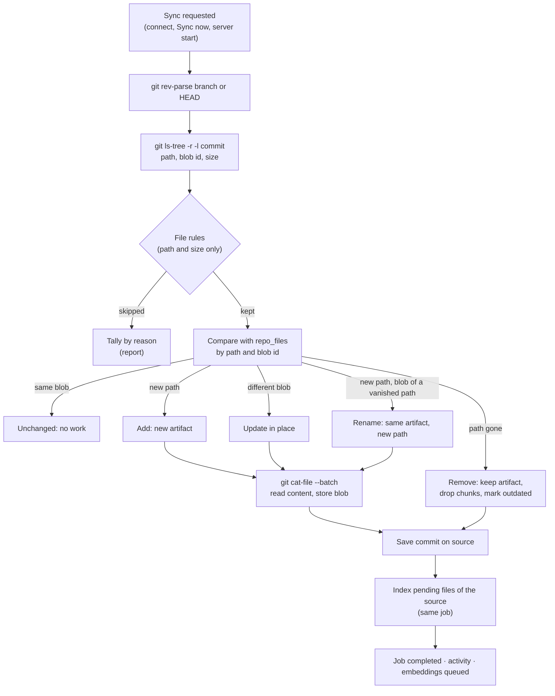

# Repository sources (git)

> **Branch of:** [TECHNICAL_MINDMAP.md](../TECHNICAL_MINDMAP.md) · **Functional view:** [FUNCTIONAL_MINDMAP.md §5b](../FUNCTIONAL_MINDMAP.md#5b-repositories) · **Status:** phase 1 (local path) shipped, see [ROADMAP.md](../ROADMAP.md#-in-progress-repository-indexing)

A repository is not a batch of uploads. It already holds many files, it keeps changing, and git records exactly what changed. RepoMemo therefore treats a repository as a **living source**: it is connected once, and each **sync** brings the workspace in step with what the chosen branch has **committed**.

---

## How to try it locally

1. Pick the folder that holds your repositories, for example `C:\Users\you\DEVHUB`.
2. Start the server with that folder allowed:

   ```powershell
   $env:REPOMEMO_JWT_SECRET = '...32+ characters...'
   $env:REPOMEMO_REPO_ROOTS = 'C:\Users\you\DEVHUB'
   cargo run -p repomemo-server
   ```

   Several folders are separated with `;` on Windows and `:` elsewhere. Without `REPOMEMO_REPO_ROOTS` the feature is off.
3. In the web client, open a workspace, go to **Repositories**, choose **Connect repository**, and enter the path of a checkout (any folder inside it works; the repository root is used).
4. The first sync starts at once. Progress, the synced commit, file counts and skipped files are shown on the repository's card. Commit something and press **Sync now** to see edits, renames and deletions followed.

`git` must be installed and on the server's `PATH`.

---

## Design in one picture



---

## Key decisions

| Decision | Why |
|---|---|
| **Read commits, not the working tree.** | What is committed is stable and reviewable. Uncommitted edits, ignored files and build output never enter the index, and `.gitignore` is respected without reimplementing it. |
| **One artifact per path, updated in place** (`repo_files`). | Uploads are unique on `(workspace, source, path, content_hash)`, so re-importing an edited file would create a second artifact and leave the stale one searchable. A repository file keeps its artifact id across edits and renames, so comments, memory links, tasks and lifecycle history stay attached. |
| **Snapshot comparison by git blob id**, not `git diff`. | Comparing the whole tree with the stored `repo_files` rows is always correct, even after a rebase or force-push, and an unchanged file costs nothing because its blob id is unchanged. |
| **Deleted files are kept, not deleted.** | Memory cards and comments may cite them. Their chunks are dropped so search and Ask stop returning code that no longer exists, and their lifecycle moves to `outdated` with a note naming the commit. |
| **The sync indexes its own files in one job** (`kind = repo_sync`). | The per-artifact queue used for uploads would create one job and one activity entry per file. A repository of thousands of files gets one job with progress and cancel instead. |
| **`git` CLI, behind a small crate** (`crates/git`). | The user's own git setup (credential helpers, `safe.directory`, long paths on Windows) applies unchanged. Only read commands are run, with `GIT_OPTIONAL_LOCKS=0`, so a sync never takes a lock in a repository someone is working in. |
| **Opt-in folders** (`REPOMEMO_REPO_ROOTS`). | Without it, a workspace administrator could read any git folder the server process can see. |

---

## Data model

Migration `0017_repo_files`:

| Column | Meaning |
|---|---|
| `source_id`, `path` | Primary key. One row per tracked path of a repository source |
| `artifact_id` | The artifact holding the file (unique) |
| `blob_sha` | Git object id of the content last stored. Equal ids mean equal content |
| `commit_sha` | Commit at which the row was last written |
| `removed_at` | Set when the path left the tree; cleared if it comes back |

The source itself is a `sources` row with `type = 'git_repo'`, `root_uri` = the repository root, and `status` = `pending | syncing | ready | error`. Its `metadata_json` holds:

```json
{
  "settings": { "branch": null, "include": [], "exclude": ["fixtures/"] },
  "last_synced_commit": { "sha": "…", "summary": "…", "author_name": "…", "committed_at": "…", "branch": "main" },
  "last_synced_at": "…",
  "last_error": null,
  "last_report": { "added": 3, "updated": 1, "renamed": 0, "removed": 0, "skipped": 12, "skipped_by_reason": [ … ], "indexed": 4, … }
}
```

A repository artifact's own `metadata_json` records `origin: "git_repo"`, the repository root, the commit and the blob id.

---

## Which files are indexed

Implemented in [`crates/ingestion/src/repo.rs`](../../crates/ingestion/src/repo.rs). Rules are decided from the path and the size git reports, before any content is read.

1. Only regular files of the commit's tree. Symbolic links and submodules are skipped.
2. **Include** patterns, when set: a file must match one.
3. **Default excludes**: `node_modules/`, `vendor/`, `dist/`, `build/`, `target/`, `.next/`, `.vite/`, `coverage/`, `__pycache__/`, lock files (`package-lock.json`, `yarn.lock`, `pnpm-lock.yaml`, `Cargo.lock`, `poetry.lock`, `Pipfile.lock`, `composer.lock`, `Gemfile.lock`, `go.sum`), `*.min.js`, `*.min.css`, `*.map`. Then the source's own **exclude** patterns.
4. Files over **1 MB**.
5. **Images** are skipped: repository images are mostly icons, and describing them needs a vision provider.
6. Known types (Markdown, code, config, Office and PDF documents) are kept as their usual artifact types. Other extensions common in repositories (Go, Java, Kotlin, C/C++, C#, Ruby, PHP, Swift, Vue, Svelte, XML, SCSS, GraphQL, Protocol Buffers, Terraform, `Dockerfile`, `Makefile`, …) become code files. Anything else is kept only if its content is UTF-8 text without NUL bytes.

**Pattern syntax** (gitignore-like): `name` or `*.ext` matches a file name at any depth; `dir/` matches everything under a directory of that name; anything with a `/` is matched against the whole path, where `*` and `?` stay within one segment and `**` spans segments (`docs/**`, `**/*.test.ts`).

---

## Lifecycle effects

Syncs change an artifact's lifecycle only from statuses a person would expect, so a reviewer's decision is not overwritten. These changes have no actor and appear as **System** in the lifecycle history.

| Event | From | To |
|---|---|---|
| A file's content changed | `verified` | `needs_review`, note "Changed in the repository at commit …" |
| A file left the tree | `active`, `needs_review`, `verified` | `outdated`, note "Removed from the repository at commit …" |
| A removed file came back | `outdated` | `active` |

---

## HTTP API

| Method | Path | Guard | Notes |
|---|---|---|---|
| GET | `/v1/workspaces/{ws}/repositories` | R | `{ local_repositories_enabled, allowed_roots, repositories }`. `allowed_roots` is empty for non-admins |
| POST | `/v1/workspaces/{ws}/repositories` | A | `{ path, name?, branch?, include[], exclude[] }`. Checks the folder and the git root against `REPOMEMO_REPO_ROOTS`, then starts the first sync. 201 with `{ repository, job }`; 409 if already connected |
| GET | `/v1/repositories/{id}` | R | One `RepoSource`, with counts and the running job, if any |
| PUT | `/v1/repositories/{id}` | A | `{ name?, branch?, include[], exclude[] }`. Applies from the next sync |
| DELETE | `/v1/repositories/{id}` | A | Deletes the source, its artifacts, chunks and memory links. 409 while syncing. The repository on disk is not touched |
| POST | `/v1/repositories/{id}/sync` | W | Queues a sync. 409 if one is running |
| GET | `/v1/repositories/{id}/files` | R | Files currently in the tree, with index state |

Progress uses the existing jobs API (`kind = repo_sync`, stages `queued → reading_repository → storing_files → indexing`) and `POST /v1/jobs/{id}/cancel`. Repository artifacts appear in `GET /v1/workspaces/{ws}/artifacts` with a `repository_id`. Renaming or deleting one through the artifact routes is refused with 400, because the next sync would undo it.

Syncs run in the background, one at a time across the server and never two for the same repository ([`apps/server/src/repositories.rs`](../../apps/server/src/repositories.rs)). At startup the server fails syncs a previous process left running and syncs every repository again, which also picks up commits made while it was down.

---

## Code map

| Piece | File |
|---|---|
| Git access (`GitRepo`, `BlobReader`) | [crates/git/src/lib.rs](../../crates/git/src/lib.rs) |
| File rules and patterns | [crates/ingestion/src/repo.rs](../../crates/ingestion/src/repo.rs) |
| `repo_files` storage, lifecycle changes | [crates/storage/src/repo.rs](../../crates/storage/src/repo.rs), [0017_repo_files.sql](../../crates/storage/migrations/0017_repo_files.sql) |
| Sync engine (`connect_local_repo`, `run_repo_sync`, …) | [crates/api/src/repo_sync.rs](../../crates/api/src/repo_sync.rs) |
| Domain types (`RepoSource`, `RepoSyncReport`, `RepoFile`) | [crates/domain/src/lib.rs](../../crates/domain/src/lib.rs) |
| HTTP routes and background runner | [apps/server/src/repositories.rs](../../apps/server/src/repositories.rs) |
| Web UI (Repositories section) | [RepositoriesPanel.tsx](../../apps/desktop/src/components/RepositoriesPanel.tsx) |

Tests: `repomemo-git` (tree parsing, reading a real repository), `repomemo-ingestion` (patterns and classification), `repomemo-api` (`syncs_follow_commits_and_keep_artifact_identity`: add, edit, rename, delete, search, remove) and `repomemo-server` (`local_repositories_sync_in_the_background_within_allowed_roots`: roles, allowed roots, background sync, refused edits).

---

## Known limits of phase 1

- **Renames are detected only when the content is identical.** A file renamed and edited in the same commit becomes a removal plus an addition, so its comments stay on the old, now outdated, artifact.
- **Syncs are manual** (plus one at server start). There is no polling or file watching yet.
- **Local folders only.** Remote URLs, credentials and webhooks are phase 2.
- **One branch per repository.** A repository root can be connected only once per workspace, so two branches of it cannot be indexed side by side yet.
- The desktop app does not have the Repositories section yet; the engine is in `RepoMemoCore` and can be exposed through Tauri commands.
- Search results do not show the commit yet, and citations are not pinned to a commit.

## Next phases

1. **Phase 1b, polish:** automatic sync when the branch moves (a cheap `rev-parse` poll), similarity-based renames via `git diff -M` when the last commit is reachable, a commit badge on search results, Tauri commands for the desktop app.
2. **Phase 2, remote repositories:** connect by URL with an encrypted token, a bare partial clone (`--filter=blob:none`) under the data directory, scheduled fetch, `https`/`ssh` only and `protocol.file.allow=never`.
3. **Phase 3, git awareness:** last author and date per file from one `git log` pass, `CODEOWNERS` as ownership hints, commit-pinned citations, push webhooks, and links to issues and pull requests.
